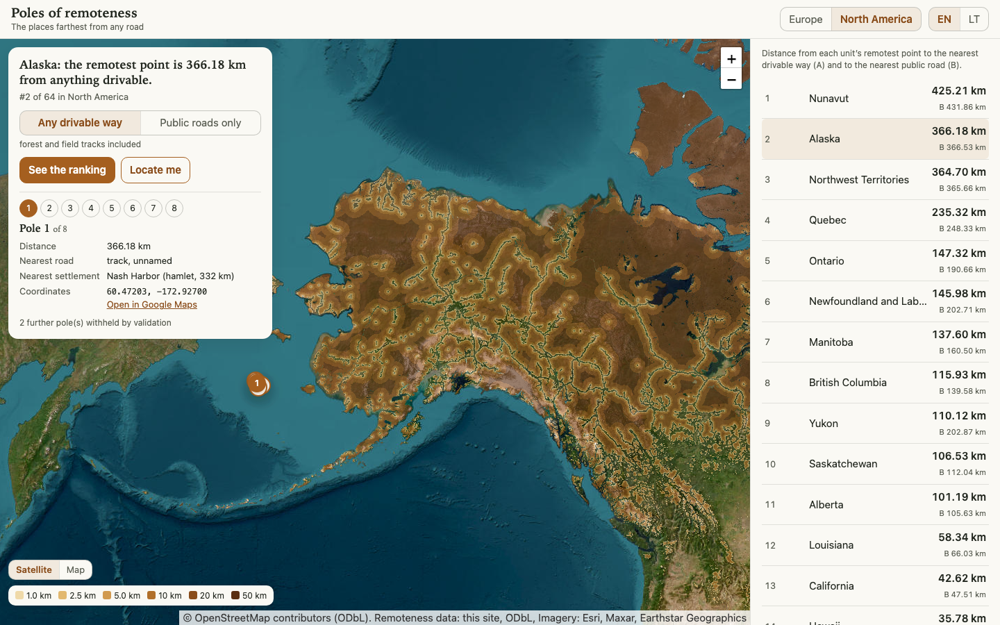

# Poles of remoteness

How far from a road can you get? This project finds, for every country in Europe and every US state and Canadian province, the point on land farthest from anything drivable, computed from OpenStreetMap data, and puts them all on an interactive map. It started with a YouTube video about the remotest spot in Norway and a simple question: what is the equivalent for Lithuania? One weekend later the answer (a bog, 3.43 km) was live and on LinkedIn; the pipeline then grew until it covered two continents.

**Live map: https://polesofremoteness.com**

## Headlines

| | Farthest from any drivable way (A) | Public roads only (B) |
|---|---|---|
| **Europe**, 52 countries | **71.4 km**: Kolbeinsey, an Icelandic islet in the Greenland Sea | **73.4 km**: North Rona, an island north of the Scottish mainland |
| **North America**, 64 states and provinces | **425.2 km**: northern Victoria Island, Nunavut | **431.9 km**: Nunavut again |
| **Lithuania**, the original weekend build | **3.43 km**: Žuvintas biosphere reserve bog | **6.67 km**: Čepkeliai raised bog |

Distance is the straight line to the nearest drivable OSM way, sea included, which is why lonely islets win. Scenario A counts every drivable way, forest and field tracks included; scenario B counts public roads only. Roads in neighbouring data always count: a point near the Texas border is only as remote as the nearest Mexican road, and the Europe extract carries Armenia through Syria so its southeastern edge is honest.

## Scale

- Input: full Geofabrik extracts, 34.8 GB (Europe plus five neighbours) and 19.3 GB (North America) of compressed OSM.
- Coarse pass: drivable ways rasterised at 250 m in an equal-area projection; a tiled Euclidean distance transform over 675 million cells (Europe) and 1.9 billion cells (North America).
- Refinement: per unit and scenario, branch-and-bound from the coarse grid down to exact vector distances at a 5 m step in the local UTM zone; 225,197 candidate refinements across 232 searches.
- Output: 2,171 published poles across 116 units, a 250 m explore layer, and 50 m detail rasters around every pole; 4,352 objects, 705 MB, on Cloudflare R2.
- Hardware: one MacBook (M-series, 24 GB RAM). Europe takes about 2.5 hours end to end, North America about 5.5.

## How it was built

AI agents (Claude) wrote effectively all of this end to end: the pipeline, the site, the tests, the CI, the docs. My role was direction and verification: choosing what to build, making the product calls, reviewing diffs, and checking results against reality. The repo is the record of that process: `docs/EUROPE_SPEC.md` (the design), `docs/EUROPE_PLAN.md` (the staged plan), `docs/DECISIONS.md` (a dated decision log), `docs/diagrams/` (how the pieces connect), and a history of small reviewed commits. Tests: 436 for the pipeline, 59 for the site tooling.

## How it works

1. **extract**: osmium filters each continent-scale PBF down to drivable ways, boundaries, places and water.
2. **classify**: ways split into scenario A (all drivable) and scenario B (public roads only).
3. **grid**: roads rasterised at 250 m; a tiled distance transform (scipy) gives every cell its distance to the nearest road.
4. **poles**: per unit and scenario, a branch-and-bound search refines a coarse cell only if it could still beat the best exact result; exact distances are vector computations (shapely STRtree) at a 5 m step.
5. **validate**: seven independent checks, from re-deriving every winner to rerunning the whole search on a half-shifted grid, plus a visual contact sheet.
6. **publish**: class-band PMTiles for the explore layer, 50 m PNG detail rasters, JSON documents for the site, uploaded to R2 and verified over the public URL.

Regions are YAML configs; nothing in the code names Europe. The antimeridian is handled: Alaska's Aleutians cross it.

## Tech

- **Pipeline**: Python 3.12 with osmium, GDAL, rasterio, shapely, pyproj and scipy. `pipeline/README.md` has the stage table and the region config reference.
- **Site**: plain HTML/CSS/JS with vendored Leaflet 1.9.4; PMTiles fetched by HTTP range requests. No build step, no framework. Bilingual (EN/LT), state in the URL, dark mode.
- **Hosting**: a Cloudflare Worker serves the static site; the heavy layers stream from R2. Analytics is a privacy-clean edge counter: no cookies, no IPs, no fingerprinting.
- **CI**: GitHub Actions deploys on push, checks the live URL, and enforces a first-screen byte budget; reference screenshots keep the desktop UI byte-identical when only mobile styles change.

## Run it

The site is static: `cd site && python3 -m http.server`, then open localhost. The pipeline is one command per region, `poles run europe`; setup and stages are in `pipeline/README.md`. The original Lithuania-only version lives in `scripts/` with its own README.

## License

Code is MIT. Map data © OpenStreetMap contributors; the derived remoteness data is available under the same ODbL terms.
