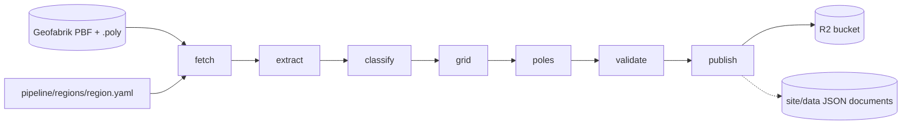
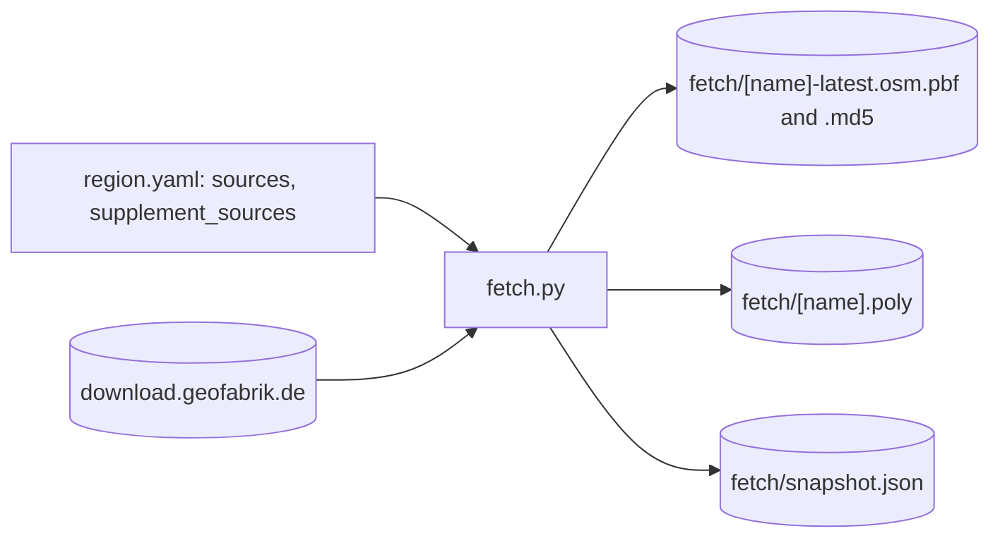
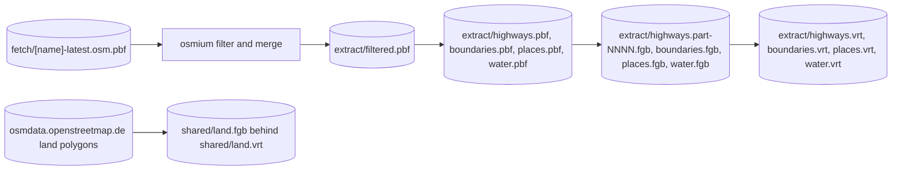
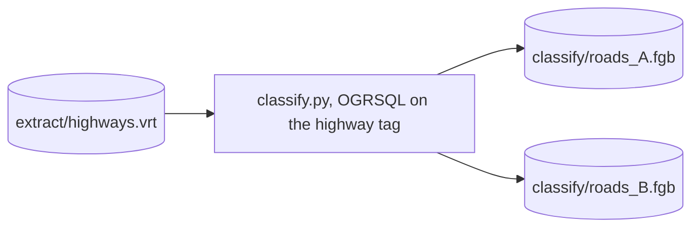
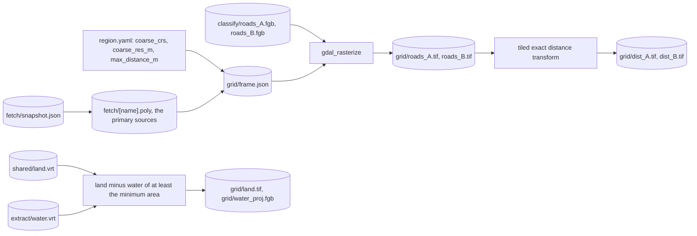
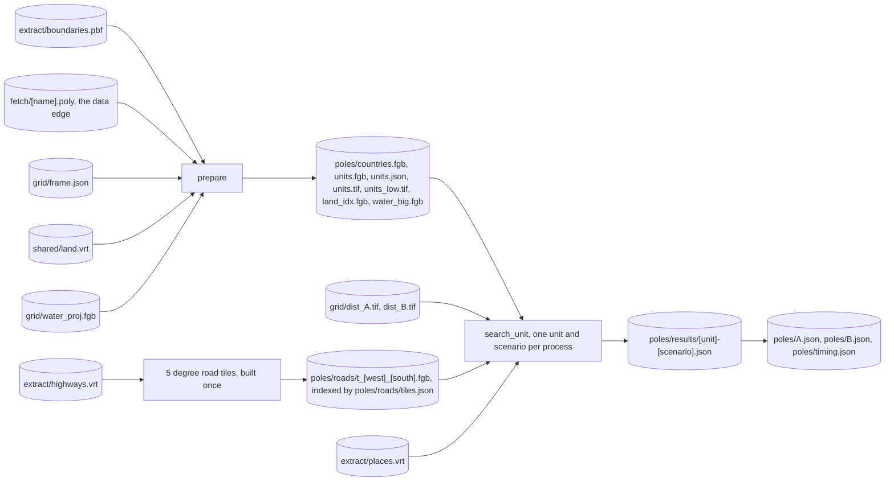
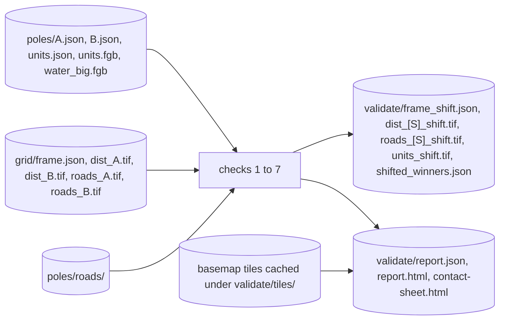
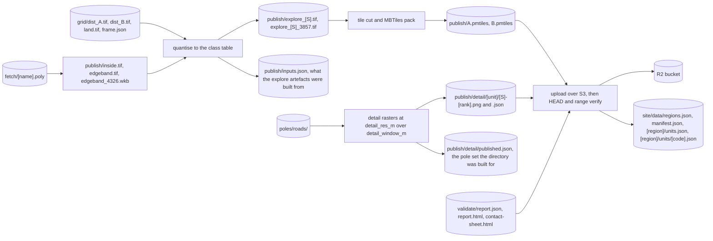

# 01: the pipeline

## At a glance

One `poles run <region> --snapshot <date>` runs the stages in this order; each stage writes `done.json` in its directory under `work/<region>/<snapshot>/` and is skipped next time unless `--force`.

The dashed arrow is the site documents: `publish` writes them into the repository's `site/data/` unless `--no-write-site`, and `--site-dir` (or `POLES_SITE_DIR`) sends them somewhere else, which is how the dev harness feeds a local site.

## Detailed view

One diagram per stage. Every path is relative to `work/<region>/<snapshot>/`, except `shared/`, which is `work/shared/` and belongs to no region. Each name below is in the code and in a run on disk: the Europe snapshot for `fetch`, `grid`, `poles`, `validate` and `publish`, the North America one for `extract` and `classify`. Long sub-steps carry a `<file>.ok` marker beside the file, which is how a crashed stage resumes at the first missing piece. One name is in the code and in no run yet: `publish/inputs.json`, the stamp added after the Europe publish, which adopts a run that predates it rather than rebuilding it.

### fetch

Downloads every source and supplement, verifies the Geofabrik md5, and records the snapshot identity that names the whole run.

### extract

Filters and merges the PBFs with osmium, then exports each layer to FlatGeobuf. The handle every later stage opens is `<layer>.vrt`, never the FlatGeobuf behind it: above the merge cap a layer lives as unindexed chunks and the VRT unions them.

### classify

Scenario membership from the highway tags, one ogr2ogr pass per scenario over the union behind `highways.vrt`.

### grid

The raster frame, the road masks, the tiled exact Euclidean distance transform, and the land mask.

### poles

`prepare` builds everything the searches share, then one process per unit and scenario runs the branch and bound down to an exact 5 m sweep in the local UTM zone and attributes the nearest road and settlement.

### validate

Seven checks that re-derive every published pole by an independent path. Check 4 recomputes the whole grid half a cell shifted, which is why this stage has the grid stage's memory profile. A pole whose nearest road may lie outside the extract is excluded rather than fatal; anything else that blocks stops the run after the three reports are written.

### publish

Quantises the grids into one class byte per pixel, cuts the explore archives, renders a detail raster per published pole, uploads everything to R2 and verifies it, and only then writes the site documents. It refuses to run without `validate/done.json`.

## What leaves the machine

Everything under `work/` is regenerable and gitignored. Two things travel:

| Destination | Keys or paths | Written by |
|---|---|---|
| R2 bucket | `<region>/<snapshot>/A.pmtiles` and `B.pmtiles`, `<region>/<snapshot>/detail/<unit>/<scenario>-<rank>.png` and `.json`, `<region>/<snapshot>/validation/report.json`, `report.html` and `contact-sheet.html` | `poles/publish/r2.py`, immutable cache headers, every key verified with a HEAD and each archive with a range request |
| git | `site/data/regions.json`, `site/data/manifest.json`, `site/data/<region>/units.json`, `site/data/<region>/units/<code>.json` | `poles/publish/sitedata.py`, validated against `poles/schemas/` before the write, and only after the R2 verification passed |

Reflects the code at Stage 5 close (2026-08-23).
