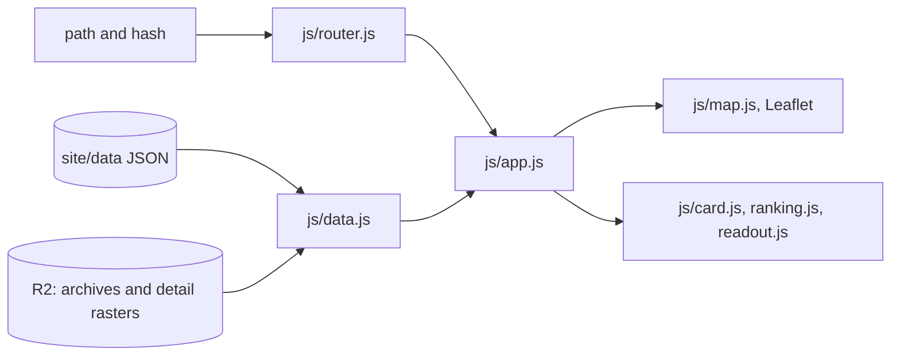
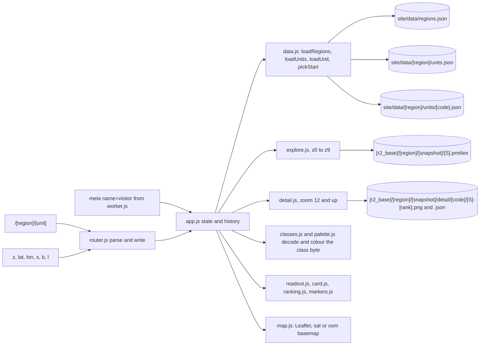

# 02: the site and its data

## At a glance

Plain ES modules, no build step. `app.js` owns the state and wires everything; every other module has one job and no knowledge of a region.

## Detailed view

`site/data/` is small, committed JSON and comes from the assets binding. Everything heavy is fetched from R2 at the `r2_base` that `regions.json` names, under `<region>/<snapshot>/`, with immutable cache headers.

### The URL is the state

The path names the region and the unit; everything else rides in the hash, so a link restores the view without a server.

| Where | Key | Values | Meaning |
|---|---|---|---|
| path | segment 1 | a region id from `regions.json` | which region |
| path | segment 2 | a unit code from that region's `units.json` | which unit is open |
| hash | `z` | 0 to 22 | zoom |
| hash | `lat` | -90 to 90 | map centre latitude |
| hash | `lon` | -180 to 180 | map centre longitude |
| hash | `s` | `A` or `B` | scenario |
| hash | `b` | `sat` or `osm` | basemap, satellite by default |
| hash | `l` | `en` or `lt` | language, otherwise the browser's, otherwise `localStorage` |

The open pole is not a hash key: selecting one flies the map, so `z`, `lat` and `lon` carry it. Anything the router does not recognise is dropped, and a region segment that does not parse takes its unit with it. `pickStart` decides the opening unit when the path does not: the visitor's own unit from the worker's meta tag, otherwise the region's rank 1.

### What the site fetches

| URL | From | When |
|---|---|---|
| `/data/regions.json` | assets binding, git | first load, then cached per URL in `data.js` |
| `/data/<region>/units.json` | assets binding, git | when a region opens, and for `pickStart` |
| `/data/<region>/units/<code>.json` | assets binding, git | when a unit opens |
| `<r2_base>/<region>/<snapshot>/<S>.pmtiles` | R2 | range requests per tile, as the explore layer needs them |
| `<r2_base>/<region>/<snapshot>/detail/<code>/<S>-<rank>.png` and `.json` | R2 | from zoom 12, for the open pole |
| basemap tiles | ArcGIS World Imagery (`sat`) or OpenStreetMap (`osm`) | as the map moves |

An asset that is not published answers with `index.html` and HTTP 200, because `not_found_handling` is `single-page-application`, so `data.js` checks the content type and raises `not-json` rather than showing the JSON parser's own message.

### The LT site on main

`main` still serves the Lithuania-only site from the same `site/` directory: `site/data/bands_A.geojson`, `bands_B.geojson`, `dist_A.png`, `dist_B.png`, `grid.json`, `land.geojson`, `places.json` and `spots.json`, about 5 MB, produced by `scripts/`. Nothing on `main` reads R2. That file set disappears at the cutover stage.

Reflects the code at Stage 5 close (2026-08-23).
