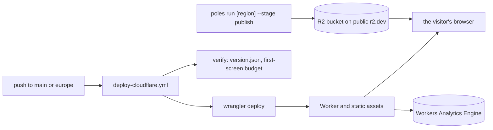
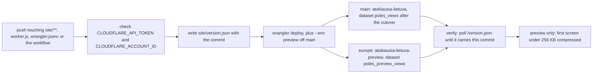
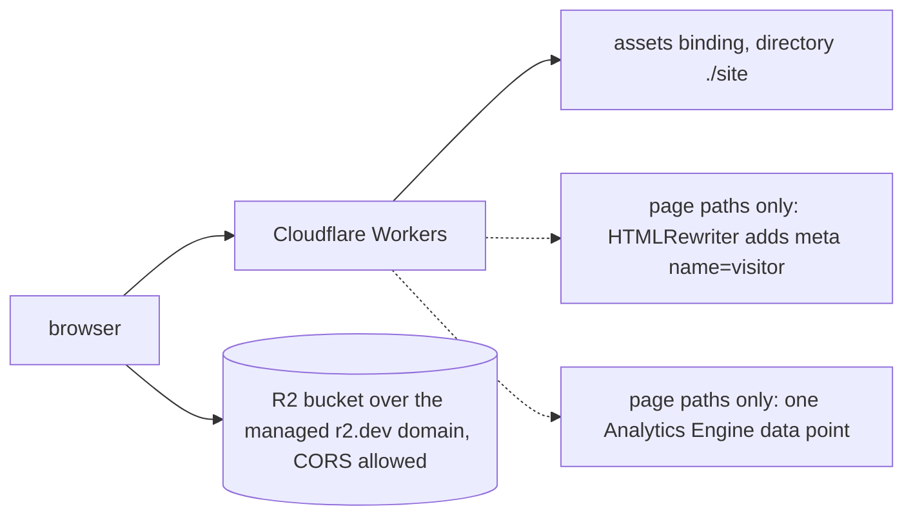
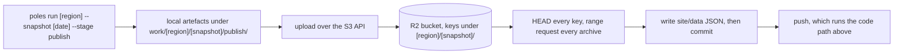

# 03: deploys and hosting

## At a glance

Two independent paths reach the visitor. The code path is a git push and takes minutes; the data path is a pipeline run on the owner's Mac and takes hours. Neither waits for the other.

## Detailed view

### The code path: a push

The production box is this branch's `wrangler.jsonc` and describes what `main` becomes at the cutover; `main` deploys its own today and logs to `atokiausia_views`. The verify job proves that this commit is live, not that some version of the site is. It polls for up to three minutes, because a new worker version reaches the edges over a few seconds and one edge can answer while another still serves the previous version. The budget step fetches every file the first screen needs and adds up the compressed bytes; `JSON_STRICT` is `0` until `site/data/<region>/` exists, so a data file answered as the SPA fallback is reported instead of failing the run.

Two other workflows guard the same repository and deploy nothing: `pipeline-tests.yml` builds `pipeline/Dockerfile` and runs pytest inside it on any change under `pipeline/`, `docs/`, `CLAUDE.md` or `README.md` (the checkout is mounted into the container as `POLES_REPO_ROOT`, so the doc pins in `pipeline/tests/test_docs_pins.py` run on docs-only commits too), and `site-tests.yml` runs `node --test 'dev/tests/*.test.mjs'` on any change under `site/js/`, `dev/` or `worker.js`.

### What is live

`run_worker_first` in `wrangler.jsonc` sends only the extension-less paths (`/`, `/<region>`, `/<region>/<unit>`) through the worker, so `/css/*`, `/js/*`, `/vendor/*`, `/data/*` and anything with an extension are answered by the assets layer and never count as a view. The data point is eight blobs, in a fixed order that queries address positionally: country, colo, referrer host, browser family, OS family, hostname, landing region, landing unit. No IP, no raw user agent, no cookie, no identifier.

### The data path: a publish

The local part runs before the R2 configuration is read, so a machine without the credentials still builds every artefact and stops with a `PublishError` naming the variables that are missing. The site documents are written only after the verification passed, so `site/data` can never name an object that did not answer.

### Secrets, by name only

Every value lives outside the repository. Nothing here is a value, only a name.

| Path | Name | Where it lives |
|---|---|---|
| code | `CLOUDFLARE_API_TOKEN` | GitHub repository secret |
| code | `CLOUDFLARE_ACCOUNT_ID` | GitHub repository secret |
| data | `POLES_R2_ACCOUNT_ID` | environment variable, the Cloudflare account id |
| data | `POLES_R2_BUCKET` | environment variable, the bucket name |
| data | `POLES_R2_TOKEN_FILE` | environment variable naming a one-line file, mode 600: the Cloudflare API token with R2 admin read and write |
| data | `POLES_R2_ACCESS_KEY_ID_FILE` | environment variable naming a one-line file, mode 600: the S3 access key id |
| data | `POLES_R2_SECRET_FILE` | environment variable naming a one-line file, mode 600: the S3 secret |
| data | `POLES_R2_BASE` | optional environment variable; when set it must equal the bucket's managed `r2.dev` domain, which the stage otherwise discovers |

Reflects the code at Stage 5 close (2026-08-23).
