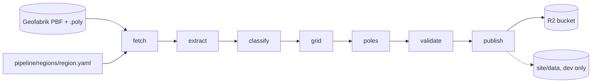

# Stage 5: North America Implementation Plan

> **For agentic workers:** REQUIRED SUB-SKILL: Use superpowers:subagent-driven-development (recommended) or superpowers:executing-plans to implement this plan task-by-task. Steps use checkbox (`- [ ]`) syntax for tracking.

**Goal:** A second region on the board. The pipeline runs North America end to end on the 2026-08-22 snapshot (fetch, extract, classify, grid, poles, validate, publish to the local publish directory; the R2 upload waits for the owner), the antimeridian defects of issue #22 are fixed with tests before that run starts, and the site gains the region control, level-4 unit naming, the Alaska screenshot and the landing rule tests.

**Architecture:** Nothing in the pipeline or the site learns the word "North America". A region is a config file (`pipeline/regions/<id>.yaml`) plus a references file, and every stage already reads its region from there. The one thing this region has that the first one did not is data on both sides of 180 degrees, so the fix is a single pure module, `pipeline/poles/antimeridian.py`, and a set of call sites that route their spatial reads through it: a ring is unwrapped before it becomes a polygon, a polygon is split back into [-180, 180] before it is written, a bounding box may be written with its east edge past 180, and every reader splits such a box into the one or two ordinary boxes the file formats understand. The site side is the mirror image: `units.json` carries a bbox whose east may exceed 180, and `unitAt` wraps the point instead of the box.

**Tech Stack:** Python 3.12 in `pipeline/.venv` (shapely 2, pyogrio, pyproj, rasterio, numpy, pytest), osmium-tool and GDAL from Homebrew, Node 22 for the site tests and the Playwright screenshot routine, plain ES modules on the site with no build step.

**Spec:** `docs/EUROPE_SPEC.md` section 2.1 (North America column), 2.2 (units), 5.3 (opening unit), 6 (checks); `docs/EUROPE_PLAN.md` stage 5 (lines 432 to 465). Issues #11 (the stage) and #22 (the antimeridian defects). The design brief for this plan is `.superpowers/sdd/2026-08-23-stage-5-north-america/design-brief.md`; its rulings are decided and are carried here as code.

## Global Constraints

- Build on branch `europe`, never on `main`. Nothing in `main` changes in this stage. The push from `europe` deploys the preview worker only.
- Commit after every working task with explicit paths (never `git add -A`). The repo's local identity (Donatas, gmail) is already set; verify with `git log -1 --format='%an <%ae>'` on the first commit of a session. No push from a task: the controller pushes.
- No em dashes anywhere: code comments, test names, docs, commit messages, issue text. Use a comma, a colon, a full stop, or parentheses.
- No secrets in the repo. Nothing under `site/data/` is hand-edited; this stage does not write `site/data/` at all (the publish stage stops before it, on purpose, until R2 exists). Local absolute paths never go into a committed file or an issue comment.
- Region configs are the only place a region is described. Nothing in code names North America, Alaska, the US or Canada. Tests use synthetic geometries at synthetic coordinates; a region id, unit code or region name may appear only in a test fixture or in the screenshot list, which are data about the run of record, not behaviour.
- Pipeline tests: `cd pipeline && .venv/bin/python -m pytest -q`. 372 pass at commit efe538f and that is the floor: every task leaves the suite green, and a task that adds behaviour adds tests before the code (write the test, run it, watch it fail for the stated reason, then write the code).
- Site tests: `node --test 'dev/tests/*.test.mjs'` from the repository root. 52 pass today and that is the floor, same rule.
- Screenshots: `NODE_PATH=<scratch>/pw/node_modules node dev/screenshots.mjs --data dev/out/site --r2 <publish dir> --r2-prefix <region>/<snapshot> --out docs/screenshots` (Playwright and chromium live in the controller's scratch directory, never inside the repo; `<scratch>` is filled in by the controller). `--only <name>` renders one shot.
- Shell: `export PATH=/opt/homebrew/bin:$PATH` in every shell that calls osmium, ogr2ogr, gdal or pmtiles. The pipeline CLI runs as `cd pipeline && export PATH=/opt/homebrew/bin:$PATH && POLES_WORKERS=4 caffeinate -i .venv/bin/poles run north-america --snapshot 2026-08-22 --work ../work --stage <stage>`.
- Memory: 24 GB on this machine. Stop colima (`colima stop`) before the grid, poles and validate stages; each reserves up to 10 GB otherwise. `POLES_WORKERS=4`. The North America frame is 45,887 x 40,022 cells (1.84 G cells, 7.3 GB per float32 raster) in the spec's LAEA.
- The snapshot id is whatever the fetch stage computes from the primary file's Last-Modified header. `2026-08-22` is the expected value and the one every command here uses; if the stage says otherwise, the work directory is renamed to what the stage says and every later command uses that date instead.

### Files no task may edit while the extract chain runs

Right after Task 1 the controller starts the extract, classify and grid chain in the background and it runs for hours. macOS spawns multiprocessing workers that re-import the code from disk, so an edit to a module a running stage imports can break it mid-run. While that chain runs, no task may edit:

`pipeline/poles/extract.py`, `pipeline/poles/classify.py`, `pipeline/poles/grid.py`, `pipeline/poles/poly.py`, `pipeline/poles/config.py`, `pipeline/poles/shell.py`, `pipeline/poles/fetch.py`, `pipeline/poles/cli.py`, `pipeline/poles/http.py`, `pipeline/poles/workspace.py`, `pipeline/poles/runner.py`, `pipeline/poles/stages.py`, `pipeline/poles/logsetup.py`.

The import graph is what makes the rest safe: those modules import only `.config`, `.poly`, `.shell`, `.workspace`, `.http`, `.errors`, `.logsetup`, `.runner`, `.stages` at module load, and the grid stage's spawned workers re-import `poles.grid` alone. Nothing in the list reaches `boundaries`, `units`, `roads`, `attrib`, `poles`, `refine`, `validate` or `publish`, which is why every task below may edit those. Verify before starting, and again if the list is ever doubted:

```bash
cd pipeline && grep -n "^from \.\|^from poles\|^import poles" poles/extract.py poles/classify.py poles/grid.py poles/poly.py poles/shell.py poles/fetch.py poles/cli.py
```

No task needs a file from the list. If one turns out to, the task stops and says so, and the controller schedules it after the chain finishes.

### Screenshot baseline

The six desktop images as committed at the start of this stage. Any task that does not deliberately change the desktop must leave every one of these byte-identical (`shasum -a 256 docs/screenshots/desktop-*.png`):

```
07b18e5ae98a040b9f48940069cedf9a4a560b017570bc4427939d8a53d461b0  docs/screenshots/desktop-about.png
1109d4412d585254a405f59235c62d3d3c09241e4ca3afcbb0e942f4d5f1f9d7  docs/screenshots/desktop-continent.png
ddf8e85a80a76608156c4cbdc7fc9bd54049aeaf96b722ed846a296b43cc5d5f  docs/screenshots/desktop-detail.png
e20c889d020d4a0a4e4adb96c7088475c99ea4a64b8783bb803741096bb3d2b2  docs/screenshots/desktop-lt-b.png
0867f65dbec028e48004aed727b068270e55233cb8c14984e00abfa5ef5f7064  docs/screenshots/desktop-lt-lang-lt.png
ef1fec7eba7643090d381808443bd8a3fe9f01270f881540e33c47e9b54ec50d  docs/screenshots/desktop-lt.png
```

Exactly one task changes them on purpose: Task 20, because the region control appears as soon as `regions.json` lists two regions, which is the feature. Task 16 proves they are byte-identical before that.

---

## File structure

Created:

- `pipeline/regions/north-america.yaml`: the region config (spec 2.1, North America column).
- `pipeline/regions/north-america-refs.yaml`: reference poles for check 6.
- `pipeline/poles/antimeridian.py`: the longitude helpers, pure geometry, no I/O.
- `pipeline/tests/test_antimeridian.py`: their tests.

Modified in the pipeline (all outside the never-edit list):

- `pipeline/poles/boundaries.py`: unwrap rings on assembly, split the assembled area before it is returned.
- `pipeline/poles/units.py`: a unit with no country is a warning and a skip.
- `pipeline/poles/roads.py`: the tile grid comes from the extract polygons' longitude intervals; a wrapped query reads both sides.
- `pipeline/poles/attrib.py`: the nearest-place shortlist uses a wrapped longitude difference.
- `pipeline/poles/poles.py`: wrapped unit bbox in `units.json`, split reads in the land and water test.
- `pipeline/poles/refine.py`: the road cache compares windows in one frame.
- `pipeline/poles/publish/detail.py`: the detail window's land and water reads are split.
- `pipeline/poles/publish/raster.py`: the published edge band dissolves the seam and is cut at the line on the way back.
- `pipeline/poles/validate/checks.py`: check 3 dissolves the seam before it measures; checks 1, 2 and 5 are examined and deliberately left alone, with the reasons in comments and guard tests.
- `pipeline/tests/test_boundaries.py`, `test_units.py`, `test_roads.py`, `test_attrib.py`, `test_poles_stage.py`, `test_refine.py`, `test_checks.py`, `test_publish_detail.py`, `test_publish_raster.py`, `test_config.py`: the tests for the above.

Modified on the site:

- `site/js/data.js`: `unitAt` wraps the point onto a bbox that runs past 180; `regionLinks` for the region control.
- `site/js/app.js`: the region control, and a map centre wrapped back into [-180, 180] before it goes into the hash.
- `site/index.html`, `site/css/app.css`, `site/js/i18n.js`: the region control's markup, styles and group label.
- `site/js/card.js`: no stray leading space when a unit has no flag.
- `dev/tests/data.test.mjs`, `dev/tests/card.test.mjs`: their tests. `dev/tests/i18n.test.mjs` already covers the naming of a unit below country level and needs nothing.
- `dev/screenshots.mjs`: one shot for the new region's top unit.
- `docs/screenshots/*.png`, `docs/screenshots/README.md`.

Documentation:

- `docs/OVERVIEW.md`, `docs/DECISIONS.md`, `docs/EUROPE_SPEC.md` (3.3 and 4.1 numbers, 2.1 `expected_units` if it is corrected). `pipeline/README.md` only if the CLI changed, and no task changes it.

---

### Task 1: Region config, references, fetch

**Files:**
- Create: `pipeline/regions/north-america.yaml`, `pipeline/regions/north-america-refs.yaml`
- Modify: `pipeline/tests/test_config.py` (one test for the new config)
- Read only: `pipeline/regions/europe.yaml`, `pipeline/regions/europe-refs.yaml`, `docs/EUROPE_SPEC.md` section 2.1

**Interfaces (already exist, this task only feeds them):**

```python
load_region(path: str | Path) -> RegionConfig      # poles/config.py
poly_url(source_url: str) -> str                   # "<name>-latest.osm.pbf" -> "<name>.poly"
```

- [ ] **Step 1.1: The config**

Write `pipeline/regions/north-america.yaml` with every value from the spec's North America column. Comments carry the reason for anything that is not a straight copy of the spec.

```yaml
# North America region. Spec: docs/EUROPE_SPEC.md section 2.1 (North America column).
# This file is the only place the region is described; nothing in code names it.
id: north-america
name: North America

sources:
  - https://download.geofabrik.de/north-america-latest.osm.pbf
# None. The land edges of this extract are the Mexico borders, which matter only if Mexico
# ever becomes a unit country (spec 2.3).
supplement_sources: []

# LAEA centred on the continent. A PROJ string rather than an EPSG code because no published
# code frames North America the way EPSG:3035 frames Europe. It is continuous across 180,
# which is why the frame arithmetic of the grid, the poles and check 5 needs no wrapping.
coarse_crs: +proj=laea +lat_0=50 +lon_0=-100 +datum=WGS84 +units=m
coarse_res_m: 250

unit_admin_level: 4           # states, provinces and territories
unit_countries: [us, ca]      # Mexico is a config change, not a code change
unit_exclude: []
unit_code_tag: ISO3166-2
# None. The unit list is explicit here, so there is nothing for a mask to remove.
territory_mask: []

edge_mask_m: 50000
max_distance_m: 400000
top_n: 10
detail_res_m: 50
detail_window_m: 20000

class_table: null             # null = the default table in spec 3.4
expected_units: 64            # spec 2.1: 51 US including DC, 13 CA. Measured at the gate in Task 17.
transcontinental: []

references: north-america-refs.yaml
```

- [ ] **Step 1.2: The config test (write it first, watch it fail)**

Add to `pipeline/tests/test_config.py`, next to `test_load_europe_config_matches_spec_table`:

```python
def test_load_north_america_config_matches_spec_table(regions_dir):
    cfg = load_region(regions_dir / "north-america.yaml")
    assert cfg.id == "north-america" and cfg.name == "North America"
    assert cfg.sources == ["https://download.geofabrik.de/north-america-latest.osm.pbf"]
    assert cfg.supplement_sources == []
    assert cfg.coarse_crs.startswith("+proj=laea") and "+lon_0=-100" in cfg.coarse_crs
    assert cfg.coarse_res_m == 250
    assert cfg.unit_admin_level == 4 and cfg.unit_code_tag == "ISO3166-2"
    assert cfg.unit_countries == ["us", "ca"] and cfg.unit_exclude == []
    assert cfg.territory_mask == [] and cfg.transcontinental == []
    assert cfg.edge_mask_m == 50_000 and cfg.max_distance_m == 400_000
    assert cfg.top_n == 10 and cfg.detail_res_m == 50 and cfg.detail_window_m == 20_000
    assert cfg.expected_units == 64
    assert cfg.references == (regions_dir / "north-america-refs.yaml").resolve()
    assert cfg.is_unit_country("us") and cfg.is_unit_country("ca") and not cfg.is_unit_country("mx")
    assert poly_url(cfg.sources[0]).endswith("/north-america.poly")
```

Run it before the yaml exists: `cd pipeline && .venv/bin/python -m pytest -q tests/test_config.py -k north_america` fails with `ConfigError` or `FileNotFoundError` on the missing file. Then write the yaml and the refs file (steps 1.1 and 1.3) and it passes. `references` resolves to a file, so the refs file has to exist before this test can pass.

- [ ] **Step 1.3: The references file**

Check 6 compares published poles against outside sources. It is a reporting check, never blocking for external entries, and a region with no prior published run has no regression entries of its own, so this file carries `external:` entries only.

Research procedure, in this order, and nothing is written that was not read:

1. Search for published "farthest from a road" positions for units of this region. Leads worth trying, in rough order of how likely they are to state a position and a distance: national and state remoteness studies, the US Geological Survey and Forest Service literature on roadless areas, the widely repeated claim about the point in the Greater Yellowstone area that is farthest from a road in the contiguous US, Canadian provincial and territorial equivalents, and any peer-reviewed roadless-area paper that names a coordinate.
2. Open every candidate page. An entry is written only when the page itself states **both** a position and a distance. A claim with no coordinates, or coordinates with no distance, is not an entry.
3. Record `unit`, `scenario`, `name`, `lat`, `lon`, `dist_m`, `source` (the URL), `note` (how that publication's question differs from ours: which roads it counts, which area it covers, what year), and `checked` (the date the page was opened, 2026-08-23).
4. Never adjust a published number to make it agree with ours. The `note` explains the difference; the check reports it.

The header comment states the rule, copying the wording of `europe-refs.yaml`:

```yaml
# North America reference poles for check 6 (spec 6.6), named by `references:` in north-america.yaml.
# There is no prior published run for this region, so there are no blocking regression entries:
# every entry here is external and informs without ever failing the stage.
#
# Every external entry was opened and read on the date in `checked`; the page states both the
# position and the distance recorded here. `note` says how that publication's question differs
# from ours, because almost every one of them counts a different set of roads.
external:
  - unit: <code>
    scenario: <A or B>
    name: "<the name the source uses>"
    lat: <from the source>
    lon: <from the source>
    dist_m: <from the source>
    source: "<url>"
    note: "<what that source counts as a road, and over what area>"
    checked: "2026-08-23"
```

The spec's column asks for three references. If fewer than three pass the bar in step 2, the file ships with what passed (an empty `external:` list is valid and check 6 reports that it had nothing to compare), and Task 21 says so in the comment on #11 rather than pretending otherwise.

- [ ] **Step 1.4: Both suites green**

```bash
cd pipeline && .venv/bin/python -m pytest -q
```

373 passing (372 plus the new config test).

- [ ] **Step 1.5: Commit**

```bash
git add pipeline/regions/north-america.yaml pipeline/regions/north-america-refs.yaml pipeline/tests/test_config.py
git commit -m "regions: north-america config from spec 2.1 and its reference poles for check 6"
```

- [ ] **Step 1.6: Run the fetch stage (controller-executed, and it has a deadline)**

The PBF is already on disk at `work/north-america/2026-08-22/fetch/north-america-latest.osm.pbf` (19,287,324,996 bytes, md5 `f78d747821d558989457c18e950fbab4`), with its `.md5` sidecar in the stage's own format and `north-america.poly` beside it. The stage adopts both: `download` returns immediately when the file is already the expected size, and the poly's resumed Range request answers 416, which the code reads as "already complete".

**This must run before 22:00 GMT on 2026-08-23.** Geofabrik replaces the `-latest` file then, and the stage deletes a local file whose sidecar disagrees with the new remote md5, which would mean a 19 GB re-download.

```bash
cd pipeline && export PATH=/opt/homebrew/bin:$PATH && caffeinate -i .venv/bin/poles run north-america --snapshot 2026-08-22 --work ../work --stage fetch 2>&1 | tee ../work/north-america/2026-08-22/fetch-run.log
```

Expect minutes, not seconds: the verification hashes 19.3 GB with md5 and sha256. What to check in the log:

- No `checksum mismatch` line. If there is one, the remote file has already been replaced; stop and tell the owner before anything re-downloads.
- No `primary Last-Modified ... does not match snapshot ...` warning. If it appears, the stage is right and the plan's date is wrong: stop the pipeline, rename `work/north-america/2026-08-22/` to the date the warning names, and use that date in every later command.
- `fetch/snapshot.json` exists, `sources[0].md5` is the md5 above, `sources[0].poly` is `north-america.poly`, and `fetch/done.json` was written.

Record the wall clock for the spec 3.3 table (Task 22 writes it into the spec).

---

### Task 2: Start the extract, classify and grid chain (controller-executed, runs in the background through Tasks 3 to 16)

**Files:** none in the repository. This task only moves work data, which is gitignored and regenerable.

- [ ] **Step 2.1: Free the disk**

There are about 39 GiB free and this region needs roughly what Europe needed. Europe's own `extract/` (47 G) and `classify/` (29 G) are the only large directories that are safe to delete: they regenerate from the kept PBFs in about an hour, and the only stage that reads `classify/` is validate's check 4, which Europe has already passed. Keep `work/europe/2026-08-19/fetch/`, `grid/`, `poles/` (the road tiles above all), `validate/` and `publish/`.

```bash
du -sh work/europe/2026-08-19/*
rm -rf work/europe/2026-08-19/extract work/europe/2026-08-19/classify
df -h /
```

- [ ] **Step 2.2: Start the chain**

colima stopped (the grid stage needs the memory), 4 workers, output to a log under the work directory, and the session never blocks on it.

```bash
colima stop
cd pipeline && export PATH=/opt/homebrew/bin:$PATH && POLES_WORKERS=4 nohup caffeinate -i .venv/bin/poles run north-america --snapshot 2026-08-22 --work ../work --stage extract > ../work/north-america/2026-08-22/extract-run.log 2>&1 &
```

Then `classify`, then `grid`, one after another (the stages are resumable and each writes `done.json`, so a single `poles run north-america --snapshot 2026-08-22 --work ../work` with no `--stage` would also walk them in order and stop at `poles`, which is Task 17's job; running them one at a time keeps each stage's timings separate for the spec table).

- [ ] **Step 2.3: Watch it without blocking**

```bash
tail -n 30 work/north-america/2026-08-22/extract-run.log
ls -la work/north-america/2026-08-22/*/done.json
```

Order of magnitude only, and only as a sanity check against a hang: Europe's extract took about an hour from scratch on a 34.8 GB PBF. Record the real numbers for the spec table; do not carry any Europe number into a North America row.

- [ ] **Step 2.4: The rule for Tasks 3 to 16 while this runs**

No task edits any file in the never-edit list above. If the chain fails, it is fixed and restarted before Task 17, and the failure is worth an issue if the cause is not obviously local.

---

### Task 3: The antimeridian helpers

Everything else in issue #22 is a call site of this module. It is pure geometry with no I/O, so it is written test first and finished before anything imports it.

**Files:**
- Create: `pipeline/poles/antimeridian.py`, `pipeline/tests/test_antimeridian.py`

**Interfaces (consumed by Tasks 4 to 11 under exactly these names):**

```python
unwrap_ring(coords) -> list[tuple[float, float]]
split_antimeridian(geom: BaseGeometry) -> MultiPolygon
lon_intervals(geom: BaseGeometry) -> list[tuple[float, float]]
wrapped_bounds(geom: BaseGeometry) -> tuple[float, float, float, float]
split_bbox(west: float, south: float, east: float, north: float) -> list[tuple[float, float, float, float]]
lon_delta(a, b)                     # scalars or numpy arrays, elementwise
TOL_DEG = 1e-6
```

- [ ] **Step 3.1: The tests, before the module exists**

Create `pipeline/tests/test_antimeridian.py`:

```python
import numpy as np
import pytest
from shapely.geometry import MultiPolygon, Point, Polygon, box

from poles.antimeridian import (lon_delta, lon_intervals, split_antimeridian, split_bbox, unwrap_ring,
                                wrapped_bounds)

# A unit drawn the way OSM stores one that sits on the line: the ring's longitudes step from 178 east
# to 178 west, which is 4 degrees of ground and 356 degrees of arithmetic.
CROSSER = Polygon([(178.0, 50.0), (-178.0, 50.0), (-178.0, 55.0), (178.0, 55.0), (178.0, 50.0)])


def test_unwrap_ring_makes_a_crossing_ring_continuous():
    assert unwrap_ring([(179.0, 0.0), (-179.0, 1.0), (179.0, 2.0)]) == [(179.0, 0.0), (181.0, 1.0), (179.0, 2.0)]
    # A ring that steps west across the line lands in the same window as one that steps east, so a
    # shell and a hole of the same relation are always written in comparable coordinates.
    assert unwrap_ring([(-179.0, 0.0), (179.0, 1.0), (-179.0, 2.0)]) == [(181.0, 0.0), (179.0, 1.0), (181.0, 2.0)]
    # A ring that stays put comes back coordinate for coordinate.
    ring = [(10.0, 0.0), (11.0, 0.0), (11.0, 1.0), (10.0, 0.0)]
    assert unwrap_ring(ring) == ring


def test_split_antimeridian_cuts_a_crossing_polygon_in_two():
    out = split_antimeridian(CROSSER)
    assert out.geom_type == "MultiPolygon" and len(out.geoms) == 2
    assert sorted(round(p.bounds[0], 6) for p in out.geoms) == [-180.0, 178.0]
    assert sorted(round(p.bounds[2], 6) for p in out.geoms) == [-178.0, 180.0]
    assert out.area == pytest.approx(4.0 * 5.0)          # 4 degrees of longitude, 5 of latitude
    assert out.contains(Point(179.5, 52.5)) and out.contains(Point(-179.5, 52.5))
    assert not out.contains(Point(0.0, 52.5))


def test_split_antimeridian_keeps_a_hole_and_leaves_an_ordinary_polygon_alone():
    holed = Polygon([(178.0, 50.0), (-178.0, 50.0), (-178.0, 55.0), (178.0, 55.0)],
                    [[(179.0, 51.0), (-179.5, 51.0), (-179.5, 51.5), (179.0, 51.5)]])
    out = split_antimeridian(holed)
    assert out.area == pytest.approx(20.0 - 1.5 * 0.5)
    assert not out.contains(Point(179.5, 51.25)) and not out.contains(Point(-179.9, 51.25))
    plain = box(20.0, 53.0, 26.5, 56.5)
    same = split_antimeridian(plain)
    assert same.geom_type == "MultiPolygon" and len(same.geoms) == 1 and same.geoms[0].equals(plain)


def test_lon_intervals_merges_and_sorts_the_parts():
    geom = MultiPolygon([box(-180.0, 50.0, -178.0, 55.0), box(178.0, 50.0, 180.0, 55.0),
                         box(-179.0, 40.0, -175.0, 45.0)])
    assert lon_intervals(geom) == [(-180.0, -175.0), (178.0, 180.0)]
    assert lon_intervals(box(20.0, 53.0, 26.5, 56.5)) == [(20.0, 26.5)]


def test_wrapped_bounds_takes_the_short_way_only_when_the_parts_touch_both_edges():
    crossing = split_antimeridian(CROSSER)
    assert crossing.bounds == (-180.0, 50.0, 180.0, 55.0)          # the plain bounds are half the planet
    assert wrapped_bounds(crossing) == (178.0, 50.0, 182.0, 55.0)  # the short way round
    apart = MultiPolygon([box(-170.0, 50.0, -160.0, 55.0), box(160.0, 50.0, 170.0, 55.0)])
    assert wrapped_bounds(apart) == apart.bounds                    # neither part reaches the line
    plain = box(20.0, 53.0, 26.5, 56.5)
    assert wrapped_bounds(plain) == (20.0, 53.0, 26.5, 56.5)
    with pytest.raises(ValueError, match="empty"):
        wrapped_bounds(MultiPolygon())


def test_split_bbox_returns_one_or_two_ordinary_boxes():
    assert split_bbox(178.0, 50.0, 182.0, 55.0) == [(178.0, 50.0, 180.0, 55.0), (-180.0, 50.0, -178.0, 55.0)]
    assert split_bbox(-182.0, 50.0, -178.0, 55.0) == [(178.0, 50.0, 180.0, 55.0), (-180.0, 50.0, -178.0, 55.0)]
    assert split_bbox(20.0, 53.0, 26.5, 56.5) == [(20.0, 53.0, 26.5, 56.5)]
    assert split_bbox(-400.0, -10.0, 400.0, 10.0) == [(-180.0, -10.0, 180.0, 10.0)]
    with pytest.raises(ValueError, match="never inverted"):
        split_bbox(170.0, 50.0, -170.0, 55.0)


def test_lon_delta_wraps_and_works_elementwise():
    assert lon_delta(179.9, -179.9) == pytest.approx(-0.2)
    assert lon_delta(-179.9, 179.9) == pytest.approx(0.2)
    assert lon_delta(10.0, 4.0) == pytest.approx(6.0)
    assert lon_delta(0.0, 0.0) == pytest.approx(0.0)
    assert lon_delta(0.0, 180.0) == pytest.approx(180.0)           # the open end of (-180, 180]
    got = lon_delta(np.array([179.9, -179.9, 10.0]), -179.9)
    assert got == pytest.approx([-0.2, 0.0, -170.1])
```

Run it: `cd pipeline && .venv/bin/python -m pytest -q tests/test_antimeridian.py` fails at collection with `ModuleNotFoundError: No module named 'poles.antimeridian'`. That is the expected first failure.

- [ ] **Step 3.2: The module**

Create `pipeline/poles/antimeridian.py`:

```python
"""Longitude helpers for data that crosses the antimeridian (issue #22).

Pure geometry in lon/lat degrees: no I/O, no configuration, and no import from another module of this
package, so any call site can use it without pulling in the stage it belongs to.

Three ideas, and everything here is one of them:

- A ring drawn across 180 is continuous only when its longitudes are unwrapped past the line. OSM stores
  the vertices at 179.9 and at -179.9, and a polygon built from those as they are runs the long way round
  the planet: 356 degrees of arithmetic for 0.2 degrees of ground.
- A geometry stored split at the line has two longitude intervals, not one bounding box 360 degrees wide.
- A bounding box that runs across the line (east above 180, or west below -180) has to be split back into
  one or two ordinary boxes before a file format or a spatial index sees it.
"""
from __future__ import annotations

import math

import shapely
from shapely.affinity import translate
from shapely.geometry import MultiPolygon, Polygon
from shapely.geometry.base import BaseGeometry
from shapely.ops import unary_union

# "Touches the antimeridian" tolerance: 1e-6 degrees is about 0.1 m at the equator, far below the
# quantum the poles stage rounds coordinates to and far above the noise of a projection round trip.
TOL_DEG = 1e-6


def _polygons(geom: BaseGeometry) -> list[Polygon]:
    """Every polygon inside a geometry, recursively; lines and points are dropped."""
    if geom is None or geom.is_empty:
        return []
    if geom.geom_type == "Polygon":
        return [geom]
    if geom.geom_type in ("MultiPolygon", "GeometryCollection"):
        return [p for part in geom.geoms for p in _polygons(part)]
    return []


def _multi(geom: BaseGeometry) -> MultiPolygon:
    if geom.geom_type == "MultiPolygon":
        return geom
    parts = _polygons(geom)
    return MultiPolygon(parts) if parts else MultiPolygon()


def unwrap_ring(coords) -> list[tuple[float, float]]:
    """The ring's coordinates made continuous: a step of more than 180 degrees of longitude between two
    consecutive vertices is the antimeridian, and everything after it is shifted by 360.

    The result is then normalised into a single window: a ring that unwrapped westwards (longitudes below
    -180) is shifted up by 360, so a shell that stepped east and a hole that stepped west are written in
    the same frame and still test as containing one another. Only a crossing ring can leave [-180, 180],
    so a ring that does not cross comes back coordinate for coordinate.
    """
    out: list[tuple[float, float]] = []
    prev: float | None = None
    shift = 0.0
    for point in coords:
        lon, lat = float(point[0]), float(point[1])
        if prev is not None:
            if lon + shift - prev > 180.0:
                shift -= 360.0
            elif lon + shift - prev < -180.0:
                shift += 360.0
        out.append((lon + shift, lat))
        prev = out[-1][0]
    if out and min(x for x, _ in out) < -180.0:
        out = [(x + 360.0, y) for x, y in out]
    return out


def split_antimeridian(geom: BaseGeometry) -> MultiPolygon:
    """A MultiPolygon whose parts all lie inside [-180, 180], cut at the line where the input crossed it.

    Each ring is unwrapped first, so a polygon drawn across the line becomes one continuous polygon
    somewhere in [-180, 540]; it is then intersected with each 360 degree strip it reaches and every piece
    outside the first strip is translated back. A geometry that does not cross is returned with its own
    coordinates, only normalised to MultiPolygon.
    """
    polys = _polygons(geom)
    if not polys:
        return MultiPolygon()
    unwrapped, crossed = [], False
    for poly in polys:
        shell = unwrap_ring(poly.exterior.coords)
        holes = [unwrap_ring(ring.coords) for ring in poly.interiors]
        unwrapped.append(Polygon(shell, holes))
        if max(x for x, _ in shell) > 180.0 + TOL_DEG:
            crossed = True
    if not crossed:
        return _multi(geom)
    pieces: list[Polygon] = []
    for poly in unwrapped:
        west, _, east, _ = poly.bounds
        first = math.floor((west + 180.0) / 360.0)
        last = math.floor((east + 180.0) / 360.0)
        for k in range(first, last + 1):
            strip = shapely.box(-180.0 + 360.0 * k, -90.0, 180.0 + 360.0 * k, 90.0)
            part = poly.intersection(strip)
            if part.is_empty:
                continue
            if k:
                part = translate(part, xoff=-360.0 * k)
            pieces.extend(_polygons(shapely.make_valid(part)))
    return _multi(unary_union(pieces)) if pieces else MultiPolygon()


def lon_intervals(geom: BaseGeometry) -> list[tuple[float, float]]:
    """The longitude spans the parts of a split geometry actually cover, sorted and merged.

    A geometry stored split at the line has two of them (about 172 to 180 and -180 to -130 for a unit on
    the line); its plain bounding box claims the whole planet, and anything that tiles or reads by that
    box does 45 times the work for nothing.
    """
    spans = sorted((p.bounds[0], p.bounds[2]) for p in _polygons(geom))
    merged: list[list[float]] = []
    for west, east in spans:
        if merged and west <= merged[-1][1]:
            merged[-1][1] = max(merged[-1][1], east)
        else:
            merged.append([west, east])
    return [(w, e) for w, e in merged]


def wrapped_bounds(geom: BaseGeometry) -> tuple[float, float, float, float]:
    """(west, south, east, north) taking the short way round the planet when the geometry straddles 180.

    A geometry stored split at the line has parts touching both 180 and -180, and its plain bounds run the
    whole world. Straddling is exactly that: parts within TOL_DEG of both edges, and a wrapped span
    shorter than the plain one. The result may have east above 180 (a unit on the line comes out as about
    west 172, east 230), which is what `split_bbox` exists to read and what units.json ships to the site.
    """
    spans = lon_intervals(geom)
    if not spans:
        raise ValueError("wrapped_bounds: an empty geometry has no bounds")
    west, south, east, north = geom.bounds
    if len(spans) < 2 or abs(spans[0][0] + 180.0) > TOL_DEG or abs(spans[-1][1] - 180.0) > TOL_DEG:
        return (west, south, east, north)
    # Cut at the widest gap between the parts: everything east of it wraps past 180.
    _, i = max((spans[j + 1][0] - spans[j][1], j) for j in range(len(spans) - 1))
    wrapped_west, wrapped_east = spans[i + 1][0], spans[i][1] + 360.0
    if wrapped_east - wrapped_west >= east - west:
        return (west, south, east, north)
    return (wrapped_west, south, wrapped_east, north)


def split_bbox(west: float, south: float, east: float, north: float) -> list[tuple[float, float, float, float]]:
    """One or two ordinary boxes inside [-180, 180] for a possibly wrapped box.

    Every spatial read goes through this: FlatGeobuf, GeoPackage and the pyogrio bbox filter all take a
    plain box and would silently return nothing for one whose east edge is 230.
    """
    if east < west:
        raise ValueError(f"split_bbox: east {east} is west of west {west}; a wrapped box is written with "
                         f"its east edge past 180 (or its west edge below -180), never inverted")
    if east - west >= 360.0:
        return [(-180.0, south, 180.0, north)]
    w = (west + 180.0) % 360.0 - 180.0
    e = w + (east - west)
    if e <= 180.0:
        return [(w, south, e, north)]
    return [(w, south, 180.0, north), (-180.0, south, e - 360.0, north)]


def lon_delta(a, b):
    """The signed difference a minus b in degrees of longitude, wrapped into (-180, 180].

    Scalars or numpy arrays, elementwise either way. Without it a place at -179.9 is 359.8 degrees from a
    pole at 179.9 instead of 0.2, and any shortlist ordered by a plain difference drops the true nearest.
    """
    return -(((b - a) + 180.0) % 360.0 - 180.0)
```

- [ ] **Step 3.3: Green**

```bash
cd pipeline && .venv/bin/python -m pytest -q tests/test_antimeridian.py && .venv/bin/python -m pytest -q
```

The new file's 7 tests pass; the whole suite is 380 passing (372 plus Task 1's config test plus these 7).

- [ ] **Step 3.4: Commit**

```bash
git add pipeline/poles/antimeridian.py pipeline/tests/test_antimeridian.py
git commit -m "antimeridian: ring unwrapping, geometry splitting, wrapped bounds and bbox splitting (#22)"
```

---

### Task 4: Boundaries assemble rings across the line

**Files:**
- Modify: `pipeline/poles/boundaries.py` (`_rings_and_open`, the tail of `_assemble`)
- Modify: `pipeline/tests/test_boundaries.py`

**Interfaces:** unchanged. `assemble(rel, ways, seeds, edge) -> MultiPolygon | None` and `assemble_area(...) -> AdminArea | None` keep their signatures; what changes is that the returned MultiPolygon's parts always lie inside [-180, 180] and a relation drawn across the line yields two parts instead of one smear round the planet.

- [ ] **Step 4.1: The tests, first**

Add to `pipeline/tests/test_boundaries.py` (it already imports `LineString`, `Point` and `assemble`; add `pytest` is already imported):

```python
def test_assemble_splits_a_relation_drawn_across_the_antimeridian():
    # Two member ways forming one ring from 178 east to 178 west, the way OSM stores a unit on the line.
    rel = Relation(5, {}, [("w", 10, "outer"), ("w", 11, "outer")])
    ways = {10: LineString([(178.0, 50.0), (179.0, 50.0), (-179.0, 50.0), (-178.0, 50.0)]),
            11: LineString([(-178.0, 50.0), (-178.0, 55.0), (178.0, 55.0), (178.0, 50.0)])}
    geom = assemble(rel, ways, {}, None)
    assert geom.geom_type == "MultiPolygon" and len(geom.geoms) == 2
    assert all(p.bounds[0] >= -180.0 and p.bounds[2] <= 180.0 for p in geom.geoms)
    assert geom.area == pytest.approx(20.0)              # 4 degrees of longitude, 5 of latitude
    assert geom.contains(Point(179.5, 52.5)) and geom.contains(Point(-179.5, 52.5))
    assert not geom.contains(Point(0.0, 52.5))


def test_assemble_across_the_line_keeps_an_inner_ring_as_a_hole():
    rel = Relation(6, {}, [("w", 10, "outer"), ("w", 11, "outer"), ("w", 12, "inner")])
    ways = {10: LineString([(178.0, 50.0), (179.0, 50.0), (-179.0, 50.0), (-178.0, 50.0)]),
            11: LineString([(-178.0, 50.0), (-178.0, 55.0), (178.0, 55.0), (178.0, 50.0)]),
            12: LineString([(179.5, 51.0), (-179.5, 51.0), (-179.5, 52.0), (179.5, 52.0), (179.5, 51.0)])}
    geom = assemble(rel, ways, {}, None)
    assert geom.area == pytest.approx(20.0 - 1.0)        # a hole 1 degree wide and 1 degree tall
    assert not geom.contains(Point(179.75, 51.5)) and not geom.contains(Point(-179.75, 51.5))
    assert geom.contains(Point(179.75, 53.0))
```

Run: `cd pipeline && .venv/bin/python -m pytest -q tests/test_boundaries.py -k antimeridian`. Both fail on the area: without the unwrap the ring runs the long way round, so shapely reports about 1780 square degrees for the first test and the hole test's inner ring is not contained by the smeared shell.

- [ ] **Step 4.2: Unwrap at ring construction**

`boundaries.py`, the import block gains one line:

```python
from .antimeridian import split_antimeridian, unwrap_ring
```

and `_rings_and_open` builds its polygons from unwrapped coordinates:

```python
def _rings_and_open(lines: list[LineString]) -> tuple[list[Polygon], list[LineString]]:
    """Merge the lines end to end, then split the result into closed rings and leftover open lines.

    A ring is unwrapped before it becomes a polygon: a relation drawn across the antimeridian stores
    vertices at 179.9 and at -179.9, and a polygon of those as they are covers the planet the wrong way
    round (issue #22). Open lines keep their original coordinates: they are closed against the data edge
    polygon below, which is in [-180, 180], and the faces that come out of that are too.
    """
    if not lines:
        return [], []
    merged = linemerge(lines) if len(lines) > 1 else lines[0]
    parts = list(merged.geoms) if merged.geom_type == "MultiLineString" else [merged]
    rings = [Polygon(unwrap_ring(p.coords)) for p in parts if p.is_ring and len(p.coords) >= 4]
    return rings, [p for p in parts if not p.is_ring]
```

- [ ] **Step 4.3: Split before the area is returned**

The tail of `_assemble` (the five lines from `geom = shapely.make_valid(...)` to the MultiPolygon coercion) becomes two:

```python
    if not polys:
        return None, False
    # Split last: make_valid on an unwrapped polygon is fine, but on a polygon smeared the wrong way round
    # the ring order is already lost, so the cut has to happen after the union and before anything reads
    # the geometry. split_antimeridian also does the Polygon and GeometryCollection to MultiPolygon
    # coercion this used to do by hand, dropping stray lines and points the same way.
    geom = split_antimeridian(shapely.make_valid(unary_union(polys)))
    if geom.is_empty or geom.geom_type != "MultiPolygon":
        return None, False
    return geom, closed_by_edge
```

- [ ] **Step 4.4: Green, including the checks that this did not change ordinary areas**

```bash
cd pipeline && .venv/bin/python -m pytest -q tests/test_boundaries.py && .venv/bin/python -m pytest -q
```

Every existing boundaries test passes unchanged: they are the evidence that a relation away from the line comes out exactly as before.

- [ ] **Step 4.5: Commit**

```bash
git add pipeline/poles/boundaries.py pipeline/tests/test_boundaries.py
git commit -m "boundaries: unwrap rings and split assembled areas at the antimeridian (#22)"
```

---

### Task 5: A unit with no country is a warning, not the end of the run

**Files:**
- Modify: `pipeline/poles/units.py` (`select_units`)
- Modify: `pipeline/tests/test_units.py`

**Interfaces:** unchanged. `select_units(areas, cfg, primary, log=None) -> list[Unit]` still raises `UnitsError` when the count disagrees with `expected_units`; what changes is that a single orphan area no longer aborts before that count is even taken.

Reconciling the two rules, because they look contradictory and are not: the loop no longer dies on the first level-4 relation whose country is missing, so every orphan is reported in one run and the operator sees the whole list. `expected_units` is still the backstop: if orphans leave the count wrong, the stage stops at the count with a message that names it, and validate's check 7 reports the same shortfall from the published output. "The run continues" means the loop continues, not that a wrong unit list ships.

- [ ] **Step 5.1: The tests, first**

Add to `pipeline/tests/test_units.py`:

```python
def test_a_unit_whose_country_is_missing_is_skipped_with_a_warning(regions_dir, caplog):
    aa = _area(1, "AA", box(0, 0, 10, 10))
    inside = _area(3, "AA-X", box(1, 1, 3, 3), level=4)
    orphan = _area(4, "ZZ-Q", box(20, 1, 22, 3), level=4, name="Orphan")   # no level-2 area holds it
    cfg = _cfg(regions_dir, unit_admin_level=4, unit_countries=["aa"], unit_exclude=[], territory_mask=[],
               expected_units=None, transcontinental=[])
    with caplog.at_level(logging.WARNING):
        units = select_units([aa, inside, orphan], cfg, box(-5, -5, 40, 15))
    assert [u.code for u in units] == ["aa-x"]
    assert "Orphan" in caplog.text and "zz-q" in caplog.text.lower() and "no country" in caplog.text


def test_a_unit_split_at_the_antimeridian_is_still_inside_the_primary_polygons(regions_dir):
    # The unit and the extract polygon are both stored split at the line, which is how Geofabrik writes
    # its poly file and how the assembler now writes an area. Planar fractions work on both as they are.
    split_unit = MultiPolygon([box(178, 50, 180, 55), box(-180, 50, -178, 55)])
    primary = MultiPolygon([box(170, 45, 180, 60), box(-180, 45, -170, 60)])
    assert inside_fraction(split_unit, primary) == pytest.approx(1.0)
    aa = _area(1, "AA", primary)
    state = _area(3, "AA-X", split_unit, level=4)
    cfg = _cfg(regions_dir, unit_admin_level=4, unit_countries=["aa"], unit_exclude=[], territory_mask=[],
               expected_units=1, transcontinental=[])
    units = select_units([aa, state], cfg, primary)
    assert [(u.code, u.country) for u in units] == [("aa-x", "aa")]
```

Run: `cd pipeline && .venv/bin/python -m pytest -q tests/test_units.py -k "no_country or antimeridian"`. The first fails with `UnitsError: unit relation 4 (Orphan) has no country`; the second passes already (it is the test the brief asks for to prove `inside_fraction` needs no change, and it is worth having as a regression).

- [ ] **Step 5.2: The change**

In `select_units`, the abort becomes a warning and a skip:

```python
        country = country_of(area, countries)
        if country is None:
            if area.level == 2 and area.code is None:
                continue  # "land mass" style relations without a code are not countries
            # A unit whose country is missing from the extract, or whose country outline the assembler
            # could not close, is one unit short, not a dead run: the whole list of orphans is worth
            # more than the first one. expected_units below and validate's check 7 catch the shortfall
            # (issue #22).
            log.warning("units: relation %d (%s, code %s) has no country in the extract; skipped",
                        area.osm_id, area.name, code)
            continue
```

Use whatever the local variable for the lowercased code is at that point in the function (the message must carry both the name and the code, which is what the test asserts); `log` is the function's logger argument, defaulting to the module logger.

- [ ] **Step 5.3: Green**

```bash
cd pipeline && .venv/bin/python -m pytest -q
```

The existing `test_unit_count_mismatch_fails` still passes: `expected_units` remains fatal, which is the point.

- [ ] **Step 5.4: Commit**

```bash
git add pipeline/poles/units.py pipeline/tests/test_units.py
git commit -m "units: an area with no country is a warning and a skip, with expected_units as the backstop (#22)"
```

---

### Task 6: Road tiles from the extract polygons, and queries that read both sides

Two changes in one task because they are two halves of the same defect: the grid is laid out from the source layer's `total_bounds`, which for a region on the line is the whole planet (72 columns of ocean), and `RoadTiles.query` silently answers only the near side of a window that runs across the line.

**Files:**
- Modify: `pipeline/poles/roads.py` (`tile_grid`, `build_tiles`, `RoadTiles.query`, one new helper)
- Modify: `pipeline/poles/poles.py` (the one `build_tiles` call in `prepare`)
- Modify: `pipeline/tests/test_roads.py`

**Interfaces:**

```python
tile_grid(bounds: tuple[float, float, float, float], tile_deg: float,
          intervals: list[tuple[float, float]] | None = None) -> list[Tile]
build_tiles(src: Path, layer: str, out_dir: Path, log, *, tile_deg: float = TILE_DEG,
            workers: int | None = None, extent: BaseGeometry | None = None) -> dict
RoadTiles.query(west, south, east, north, where=None,
                columns=("osm_id", "highway", "name", "ref")) -> RoadSet   # accepts a wrapped bbox
EXTENT_PAD_DEG = 0.5
```

Both new arguments are keyword and optional, so every existing caller and every existing test keeps working, and Europe's finished `poles/roads/` is not invalidated (the tiles are rebuilt only when `tiles.json` is absent).

- [ ] **Step 6.1: The tests, first**

In `pipeline/tests/test_roads.py`, widen the shapely import to `from shapely.geometry import LineString, MultiPolygon, box` (it imports `LineString` alone today) and add:

```python
def test_tile_grid_from_longitude_intervals_skips_the_empty_ocean():
    # The shape a region drawn across the antimeridian has: its plain bounds run the whole world and
    # would tile 72 columns, of which 68 are ocean nobody asked about.
    bounds = (-180.0, 50.0, 180.0, 60.0)
    intervals = [(-180.0, -170.0), (170.0, 180.0)]
    tiles = tile_grid(bounds, 5.0, intervals)
    assert {t.name for t in tiles} == {"t_-180_50", "t_-175_50", "t_170_50", "t_175_50",
                                       "t_-180_55", "t_-175_55", "t_170_55", "t_175_55"}
    assert len(tile_grid(bounds, 5.0)) == 72 * 2


def test_build_tiles_lays_the_grid_out_from_the_extent_when_it_is_given(tmp_path, log):
    src = _roads(tmp_path)
    extent = MultiPolygon([box(0.0, 40.0, 9.0, 60.0), box(11.0, 40.0, 20.0, 60.0)])
    meta = build_tiles(src, "highways", tmp_path / "roads", log, tile_deg=10.0, workers=2, extent=extent)
    assert {t["name"] for t in meta["tiles"]} == {"t_0_40", "t_10_40", "t_0_50", "t_10_50"}
    assert sum(t["features"] for t in meta["tiles"]) == 402


def test_build_tiles_refuses_an_extent_that_does_not_cover_the_source(tmp_path, log):
    # The coverage guard used to be satisfied by construction (the grid came from the source's own
    # bounds). Now that the grid comes from the extract polygons it is the real check that the two agree.
    src = _roads(tmp_path)
    with pytest.raises(PolesError, match="but the source has"):
        build_tiles(src, "highways", tmp_path / "roads2", log, tile_deg=10.0, workers=2,
                    extent=box(0.0, 40.0, 9.0, 49.0))


def test_query_reads_both_sides_of_the_antimeridian(tmp_path, log):
    # Two ways either side of the line and one way across it: in the tile grid they are 360 degrees
    # apart, on the ground 0.1 degrees. The way across the line lands in both tiles under one osm_id.
    geoms = [LineString([(179.95, 51.9), (179.95, 52.1)]),
             LineString([(-179.95, 51.9), (-179.95, 52.1)]),
             LineString([(179.99, 52.0), (-179.99, 52.0)])]
    src = write_fgb(tmp_path / "highways.fgb", "highways", geoms,
                    {"osm_id": [1, 2, 3], "highway": ["track"] * 3, "name": [None] * 3, "ref": [None] * 3})
    out = tmp_path / "roads"
    extent = MultiPolygon([box(179.0, 51.0, 180.0, 53.0), box(-180.0, 51.0, -179.0, 53.0)])
    build_tiles(src, "highways", out, log, tile_deg=10.0, workers=2, extent=extent)
    tiles = RoadTiles(out)
    assert sorted(int(i) for i in tiles.query(179.9, 51.95, 180.1, 52.05).attrs["osm_id"]) == [1, 2, 3]
    # The same window written the other way round reads the same three ways.
    assert sorted(int(i) for i in tiles.query(-180.1, 51.95, -179.9, 52.05).attrs["osm_id"]) == [1, 2, 3]
    # An ordinary window still behaves like an ordinary window.
    assert sorted(int(i) for i in tiles.query(179.90, 51.95, 179.93, 52.05).attrs["osm_id"]) == [3]
```

Run: `cd pipeline && .venv/bin/python -m pytest -q tests/test_roads.py`. The first fails with a `TypeError` on the third positional argument, the next two with `TypeError: build_tiles() got an unexpected keyword argument 'extent'`, and the last returns `[1, 3]` (the far side of the line is never opened).

- [ ] **Step 6.2: `tile_grid` takes the intervals**

```python
def tile_grid(bounds: tuple[float, float, float, float], tile_deg: float,
              intervals: list[tuple[float, float]] | None = None) -> list[Tile]:
    """Tiles of tile_deg anchored at multiples of tile_deg, covering bounds (west, south, east, north).

    `intervals` are the longitude spans that actually hold data. Without them the whole west to east span
    is tiled, which is what a layer's total_bounds asks for and is exactly wrong for a region drawn across
    the antimeridian: its bounds run -180 to 180 and the empty half of the planet gets tiled too (issue
    #22). Columns are clipped to [-180, 180): a tile west of -180 is the same ground as one just under
    180, and the tiles are cut from data that is already stored split at the line.
    """
    spans = intervals if intervals is not None else [(bounds[0], bounds[2])]
    wests: list[float] = []
    for west, east in spans:
        x = math.floor(west / tile_deg) * tile_deg
        while x < east:
            if -180.0 <= x < 180.0 and x not in wests:
                wests.append(x)
            x += tile_deg
    wests.sort()
    tiles = []
    south = math.floor(bounds[1] / tile_deg) * tile_deg
    while south < bounds[3]:
        for west in wests:
            tiles.append(Tile(f"t_{_fmt(west)}_{_fmt(south)}", west, south, west + tile_deg, south + tile_deg))
        south += tile_deg
    return tiles
```

- [ ] **Step 6.3: `build_tiles` takes the extent**

New module constant next to `TILE_DEG`:

```python
# osmium keeps whole ways, so a road can run a little past the extract polygon; the grid is padded by
# this much before it is snapped outward to whole tiles.
EXTENT_PAD_DEG = 0.5
```

New import and helper:

```python
from shapely.geometry.base import BaseGeometry

from .antimeridian import lon_intervals, split_bbox


def _extent_grid(extent: BaseGeometry, pad: float) -> tuple[tuple[float, float, float, float],
                                                            list[tuple[float, float]]]:
    """Latitude bounds and longitude intervals of the extract polygons, padded and clipped to the world."""
    west, south, east, north = extent.bounds
    bounds = (max(-180.0, west - pad), max(-90.0, south - pad),
              min(180.0, east + pad), min(90.0, north + pad))
    intervals = [(max(-180.0, w - pad), min(180.0, e + pad)) for w, e in lon_intervals(extent)]
    return bounds, intervals
```

and the head of `build_tiles`:

```python
def build_tiles(src: Path, layer: str, out_dir: Path, log: logging.Logger, *, tile_deg: float = TILE_DEG,
                workers: int | None = None, extent: BaseGeometry | None = None) -> dict:
    """One `ogr2ogr -spat` pass per tile over the unindexed source; every non-empty tile becomes an indexed
    FlatGeobuf guarded by a `.ok` marker, so a rerun skips finished tiles. Writes tiles.json last.

    `extent` is the union of the extract polygons. Given it, the grid follows the land the extract
    actually holds rather than the layer's total bounds, which for a region drawn across the antimeridian
    is the whole planet. The coverage check at the end is what keeps the two honest: a grid that misses
    part of the source refuses to ship.
    """
    require_tools(["ogr2ogr"])
    out_dir.mkdir(parents=True, exist_ok=True)
    info = read_info(str(src), layer=layer, force_feature_count=True)
    source_features = _source_count(src, layer, info)
    if extent is None:
        bounds, intervals = _bounds(src, layer, info), None
    else:
        bounds, intervals = _extent_grid(extent, EXTENT_PAD_DEG)
    grid = tile_grid(bounds, tile_deg, intervals)
    workers = _worker_count(workers)
    log.info("roads: %d tiles of %s deg over %s%s with %d workers", len(grid), tile_deg, bounds,
             f" in {len(intervals)} longitude interval(s)" if intervals else "", workers)
```

The rest of the function is untouched.

- [ ] **Step 6.4: `RoadTiles.query` splits a wrapped bbox**

```python
    def query(self, west: float, south: float, east: float, north: float, where: str | None = None,
              columns=("osm_id", "highway", "name", "ref")) -> RoadSet:
        """Roads intersecting the bbox, in lon/lat, deduplicated by osm_id across the tile seams.

        The bbox may be wrapped (east past 180, or west below -180): it is split into the one or two
        ordinary boxes the tiles and the pyogrio bbox filter understand, and the dedup that already
        covers the tile seams covers the antimeridian seam too, since a way stored on both sides keeps
        one osm_id. osm_id is what the dedup keys on, so it is always read; it comes back in attrs only
        if asked for.
        """
        wanted = tuple(columns)
        columns = wanted if "osm_id" in wanted else ("osm_id",) + wanted
        geoms: list[np.ndarray] = []
        attrs: dict[str, list[np.ndarray]] = {c: [] for c in columns}
        for w, s, e, n in split_bbox(west, south, east, north):
            for tile in self.tiles:
                if not tile.intersects(w, s, e, n):
                    continue
                meta, _, wkb, fields = read(str(self.dir / f"{tile.name}.fgb"), layer=self.layer,
                                            columns=list(columns), bbox=(w, s, e, n), where=where)
                if len(wkb) == 0:
                    continue
                by_name = dict(zip(meta["fields"], fields))
                geoms.append(shapely.from_wkb(wkb))
                for c in columns:
                    attrs[c].append(np.asarray(by_name[c], dtype=object))
        if not geoms:
            return RoadSet.empty(wanted)
```

The tail (concatenate, `np.unique` on `osm_id`, `first.sort()`, return) is unchanged.

- [ ] **Step 6.5: The one call site**

In `pipeline/poles/poles.py`, `prepare()` builds the road tiles once per run. It already has `edge`, the union of every source polygon, a few lines above:

```python
        build_tiles(extract_dir / "highways.vrt", "highways", roads_dir, log, extent=edge)
```

Europe's `poles/roads/tiles.json` exists, so that branch does not run for Europe and its 116 tiles stay exactly as they are.

- [ ] **Step 6.6: Green**

```bash
cd pipeline && .venv/bin/python -m pytest -q tests/test_roads.py tests/test_poles_stage.py && .venv/bin/python -m pytest -q
```

`test_tile_grid_snaps_outward_and_names_by_corner` and `test_build_tiles_covers_every_feature_and_skips_empty` pass unchanged: with no intervals the grid is exactly what it was.

- [ ] **Step 6.7: Commit**

```bash
git add pipeline/poles/roads.py pipeline/poles/poles.py pipeline/tests/test_roads.py
git commit -m "roads: tile from the extract polygons' longitude intervals and read both sides of a wrapped bbox (#22)"
```

---

### Task 7: The nearest-settlement shortlist reaches across the line

`Places.nearest` picks its k=64 candidates with a planar longitude difference. A pole at 179.99 and a village at -179.99 are 1.1 km apart and 359.98 degrees apart in that arithmetic, so the true nearest never makes the shortlist and the published `nearest_place` is a settlement hundreds of kilometres away. The geodesic measurement afterwards is already correct; only the shortlist is wrong.

**Files:**
- Modify: `pipeline/poles/attrib.py` (`Places.nearest`)
- Modify: `pipeline/tests/test_attrib.py`

**Interfaces:** none new; `lon_delta` from Task 3 is consumed here under that exact name.

- [ ] **Step 7.1: The test, first**

Add to `pipeline/tests/test_attrib.py`:

```python
def test_places_nearest_shortlist_reaches_across_the_antimeridian(tmp_path):
    # Across is 0.11 degrees of longitude from the query point, Decoy is 0.99 degrees; in plain
    # arithmetic Across looks 359.89 degrees away and loses the only shortlist slot to Decoy.
    fgb = write_fgb(tmp_path / "places.fgb", "places", [Point(179.90, 52.0), Point(-179.00, 52.0)], {
        "osm_id": [1, 2], "name": ["Across", "Decoy"], "name:en": [None, None],
        "place": ["village", "village"], "population": [None, None]})
    near = Places(fgb, layer="places").nearest(-179.99, 52.0, k=1)
    assert near["name"] == "Across"
    assert near["dist_m"] == pytest.approx(7554, rel=0.02)
```

Run: `cd pipeline && .venv/bin/python -m pytest -q tests/test_attrib.py`. It fails with `AssertionError: assert 'Decoy' == 'Across'`.

- [ ] **Step 7.2: The fix**

In `pipeline/poles/attrib.py`, import the helper and use it for the longitude term:

```python
from .antimeridian import lon_delta
```

```python
    def nearest(self, lon: float, lat: float, k: int = 64) -> dict | None:
        if len(self.lon) == 0:
            return None
        scale = np.cos(np.radians(lat))
        # The longitude term wraps: on a region that crosses the antimeridian a plain difference makes
        # the nearest settlement look 360 degrees away and it never reaches the geodesic step (issue #22).
        planar = (lon_delta(self.lon, lon) * scale) ** 2 + (self.lat - lat) ** 2
        idx = np.argpartition(planar, min(k, len(planar) - 1))[:k]
```

The rest of the method is unchanged: `GEOD.inv` already measures the short way round, so the published distance was never the problem.

- [ ] **Step 7.3: Green**

```bash
cd pipeline && .venv/bin/python -m pytest -q tests/test_attrib.py && .venv/bin/python -m pytest -q
```

`test_places_nearest_is_geodesic_and_prefers_english_name` is the regression guard for ordinary longitudes and must still pass: away from the line `lon_delta` is the plain difference.

- [ ] **Step 7.4: Commit**

```bash
git add pipeline/poles/attrib.py pipeline/tests/test_attrib.py
git commit -m "attrib: wrap the longitude term of the nearest-settlement shortlist (#22)"
```

---

### Task 8: The poles stage reads a unit that sits on the line

Three places in `pipeline/poles/poles.py` take `unit.geometry.bounds`, which for a unit split at 180 is the whole world: `-180, lat_s, 180, lat_n`. One of them is published (`bbox` in units.json, which the site uses to place and zoom the unit), one reads the land and water indexes (the whole planet's coastline at those latitudes, several GB), and one is the fallback raster window (the full frame width, measured below as 800 columns of an 800 column frame where 72 is the true answer).

**Files:**
- Modify: `pipeline/poles/poles.py` (`prepare`'s units.json write, `_bbox_window`, `_allowed_factory`)
- Modify: `pipeline/tests/test_poles_stage.py`

**Interfaces:** none new; `wrapped_bounds` and `split_bbox` from Task 3 are consumed here under those exact names.

- [ ] **Step 8.1: The tests, first**

`_prepare_workspace` builds the unit list inline today. Give it a parameter so a test can put a different unit in the workspace, leaving every existing caller unchanged:

```python
def _prepare_workspace(tmp_path, monkeypatch, unit=None):
    """The least on-disk state prepare() needs to reach its units.tif branch: the rest is marked done or stubbed."""
    ...
    write_units([unit or Unit("aa", "Aa", "Aa", 1, "aa", MultiPolygon([box(0, 0, 1, 1)]), False, 1)], out / "units.fgb")
```

Then add the three tests:

```python
def test_units_json_bbox_takes_the_short_way_round_the_line(tmp_path, cfg, log, monkeypatch):
    # The bbox units.json publishes is what the site zooms to. Written from plain bounds, a unit split at
    # the line asks the map to show the whole world (issue #22).
    straddler = Unit("aa", "Aa", "Aa", 1, "aa",
                     MultiPolygon([box(178.0, 50.0, 180.0, 55.0), box(-180.0, 50.0, -178.0, 55.0)]), False, 1)
    ws, out = _prepare_workspace(tmp_path, monkeypatch, unit=straddler)
    poles_mod.prepare(cfg, ws, log)
    bbox = json.loads((out / "units.json").read_text(encoding="utf-8"))["units"][0]["bbox"]
    assert bbox == [178.0, 50.0, 182.0, 55.0]


def test_allowed_reads_only_the_two_windows_a_unit_on_the_line_covers(tmp_path, monkeypatch):
    unit = Unit("aa", "Aa", "Aa", 1, "aa",
                MultiPolygon([box(178.0, 50.0, 180.0, 52.0), box(-180.0, 50.0, -178.0, 52.0)]), False, 1)
    land = write_fgb(tmp_path / "land.fgb", "land",
                     [box(177.5, 49.5, 180.0, 52.5), box(-180.0, 49.5, -177.5, 52.5)], {"osm_id": [1, 2]})
    water = write_fgb(tmp_path / "water.fgb", "water", [box(179.0, 50.5, 179.2, 50.7)], {"osm_id": [1]})
    seen = []
    real_read = poles_mod.read
    monkeypatch.setattr(poles_mod, "read", lambda *a, **k: (seen.append(k["bbox"]), real_read(*a, **k))[1])
    allowed = _allowed_factory(unit, land, water)
    # Two reads per index, one per side of the line, and never a box that spans the planet.
    assert [round(v, 6) for b in seen for v in b] == [177.95, 49.95, 180.0, 52.05,
                                                      -180.0, 49.95, -177.95, 52.05] * 2
    lons = np.array([179.0, -179.0, 179.1, 170.0])   # east of the line; west of it; in the lake; outside the unit
    lats = np.array([51.0, 51.0, 50.6, 51.0])
    assert allowed(lons, lats).tolist() == [True, True, False, False]


def test_bbox_window_of_a_unit_on_the_line_is_narrow_and_holds_the_far_side():
    """The fallback window when units.json has no window for a unit. Measured: 800 columns of an 800
    column frame before the fix, 72 after, with the far side of the line inside it either way."""
    crs = "+proj=laea +lat_0=50 +lon_0=170 +datum=WGS84 +units=m"
    to_frame = Transformer.from_crs("EPSG:4326", crs, always_xy=True)
    frame = Frame(crs, 5000.0, -2_000_000.0, 2_000_000.0, 800, 800)
    straddler = Unit("aa", "Aa", "Aa", 1, "aa",
                     MultiPolygon([box(178.0, 50.0, 180.0, 55.0), box(-180.0, 50.0, -178.0, 55.0)]), False, 1)
    win = _bbox_window(straddler, frame, to_frame)
    assert win.width < 200                              # about 4 degrees of ground, not 360
    fx, fy = to_frame.transform(-179.0, 52.5)           # a point on the far side of the line
    col, row = int((fx - frame.x0) / frame.res), int((frame.y1 - fy) / frame.res)
    assert win.col_off <= col < win.col_off + win.width
    assert win.row_off <= row < win.row_off + win.height
```

Run: `cd pipeline && .venv/bin/python -m pytest -q tests/test_poles_stage.py`. The first fails with `assert [-180.0, 50.0, 180.0, 55.0] == [178.0, 50.0, 182.0, 55.0]`, the second with a single `(-180.05, 49.95, 180.05, 52.05)` box per index, the third with `assert 800 < 200`.

- [ ] **Step 8.2: The published bbox**

Import at the top of `pipeline/poles/poles.py`:

```python
from .antimeridian import split_bbox, wrapped_bounds
```

and in `prepare`'s units.json write:

```python
            "bbox": list(wrapped_bounds(u.geometry)), "window": list(windows_by_index[u.index]) if u.index in windows_by_index else None}
```

- [ ] **Step 8.3: The land and water reads**

```python
def _allowed_factory(unit: Unit, land_idx: Path, water_big: Path):
    """Point allowed when inside the unit, on a land polygon, and in no water polygon of 1 km2 or more."""
    w, s, e, n = wrapped_bounds(unit.geometry)
    pad = 0.05
    # A unit split at the antimeridian has plain bounds of -180 to 180, so a single read would pull the
    # whole planet's coastline at these latitudes. The wrapped box is the unit's real extent and splits
    # into the one or two boxes the bbox filter understands (issue #22).
    parts = split_bbox(w - pad, s - pad, e + pad, n + pad)
    lwkb = [read(str(land_idx), layer="land", bbox=p)[2] for p in parts]
    wwkb = [read(str(water_big), layer="water", bbox=p)[2] for p in parts]
    land_geoms = [g for chunk in lwkb for g in shapely.from_wkb(chunk)]
    water_geoms = [g for chunk in wwkb for g in shapely.from_wkb(chunk)]
    land_tree = STRtree(land_geoms) if land_geoms else None
    water_tree = STRtree(water_geoms) if water_geoms else None
```

The rest of the closure is unchanged. A polygon that lies in both parts is added twice; an STRtree of candidate geometries answers `intersects` the same either way, so the duplicate costs a node and changes no answer.

- [ ] **Step 8.4: The fallback window**

```python
def _bbox_window(unit: Unit, frame: Frame, to_frame: Transformer) -> Window:
    """The frame window covering the unit's lon/lat bbox, one cell wider each way and clamped to the frame.

    The bbox is the wrapped one, so a unit split at the antimeridian gets its own 4 degrees rather than
    the whole world (issue #22). The frame CRS is continuous across 180 (the region's LAEA, centred on
    the region), and pyproj normalises a longitude above 180 into it, so the segmentized ring projects
    to one compact run of columns.
    """
    ring = shapely.segmentize(shapely.box(*wrapped_bounds(unit.geometry)).exterior, 0.1)
```

The rest is unchanged. This is beyond the letter of the #22 rulings, which name the published bbox and the land reads; it is the same defect in the same function family and the measured numbers above are the argument. Task 22 records it in `docs/DECISIONS.md`.

- [ ] **Step 8.5: The refiner's road window needs nothing**

For the record, so a reviewer does not go looking: the refiner at the end of `search_unit` builds its road window as `cache.get(lon - dlon, lat - dlat, lon + dlon, lat + dlat, epsg)`, which near the line produces west below -180 or east above 180 (at latitude 71 the `1 / cos(lat)` factor makes `dlon` about three times `dlat`, so a 400 km radius asks for roughly 11 degrees each way). That wrapped box is handled by `RoadCache.get` (Task 9) and `RoadTiles.query` (Task 6). `utm_epsg(lon, lat)` also stays as it is: PROJ handles a UTM zone at the dateline, and zone 1 and zone 60 are ordinary zones.

- [ ] **Step 8.6: Green**

```bash
cd pipeline && .venv/bin/python -m pytest -q tests/test_poles_stage.py && .venv/bin/python -m pytest -q
```

`test_allowed_needs_the_unit_and_land_and_no_big_water` and `test_bbox_window_floors_and_ceils_flips_y_and_clamps_to_the_frame` are the regression guards for ordinary units: away from the line `wrapped_bounds` is `bounds` and `split_bbox` returns one box.

- [ ] **Step 8.7: Commit**

```bash
git add pipeline/poles/poles.py pipeline/tests/test_poles_stage.py
git commit -m "poles: wrapped unit bbox for units.json, the land reads and the fallback window (#22)"
```

---

### Task 9: The road cache and the detail window near the line

Two consumers of a bbox that Task 6 now answers correctly but that still ask the wrong question. `RoadCache.get` compares a request against the cached window with plain `<=`, so the two spellings of one window (east past 180, west below -180) never match and every refinement near the line re-queries the tiles. `publish/detail.py` reads the land and water indexes with the raw window, so a detail raster centred near the line sees land only on the near side, blanks the far half, and can raise the "nearest land in the index is N metres away" error with N measured the long way round the planet.

**Files:**
- Modify: `pipeline/poles/refine.py` (`RoadCache.get`, one new module-level helper)
- Modify: `pipeline/poles/publish/detail.py` (`land_test`, `_nearest_land_m`)
- Modify: `pipeline/tests/test_refine.py`, `pipeline/tests/test_publish_detail.py`

**Interfaces:**

```python
_lon_inside(cached_west: float, cached_east: float, west: float, east: float) -> bool   # refine.py, private
```

- [ ] **Step 9.1: The tests, first**

Add to `pipeline/tests/test_refine.py`:

```python
def test_road_cache_treats_the_two_spellings_of_a_window_across_the_line_as_one():
    # 179.3 to 180.7 and -180.5 to -179.5 are the same ground written two ways. Compared with plain
    # arithmetic the second is nowhere near the first, so the cache misses on every cell near the line
    # and the tiles are read again for each one (issue #22).
    tiles = _FakeTiles()
    cache = RoadCache(tiles, pad_deg=0.5)
    r1 = cache.get(179.3, 54.0, 180.7, 54.4, 32601)
    r2 = cache.get(-180.5, 54.05, -179.5, 54.35, 32601)
    assert r1 is r2 and len(tiles.calls) == 1
    cache.get(178.0, 54.0, 178.2, 54.2, 32601)          # genuinely outside the cached window: a fresh query
    assert len(tiles.calls) == 2
```

Add to `pipeline/tests/test_publish_detail.py`:

```python
def test_land_test_reads_both_sides_of_a_window_that_runs_past_the_line(tmp_path):
    write_fgb(tmp_path / "land_idx.fgb", "land",
              [box(179.9, 54.9, 180.0, 55.1), box(-180.0, 54.9, -179.9, 55.1)], {"id": [1, 2]})
    write_fgb(tmp_path / "water_big.fgb", "water", [box(-179.98, 54.98, -179.96, 55.02)], {"id": [1]})
    ok = detail.land_test(tmp_path / "land_idx.fgb", tmp_path / "water_big.fgb", (179.85, 54.85, 180.15, 55.15))
    got = ok(np.array([179.95, -179.95, -179.97, 179.5]), np.array([55.0, 55.0, 55.0, 55.0]))
    assert got.tolist() == [True, True, False, False]   # near side; far side; far side in the lake; off the land


def test_nearest_land_measures_across_the_line_not_around_the_world(tmp_path):
    # The blank-window guard turns this number into a hard error at 100 m. Measured the long way round it
    # is 40,000 km and every islet on the line becomes a failed run (issue #22).
    write_fgb(tmp_path / "land_idx.fgb", "land", [box(-179.99, 54.99, -179.97, 55.01)], {"id": [1]})
    near = detail._nearest_land_m(tmp_path / "land_idx.fgb", (179.9, 54.9, 180.1, 55.1), 179.995, 55.0)
    assert near == pytest.approx(1670, rel=0.01)        # 0.015 degrees of longitude at M_PER_DEG
```

Run: `cd pipeline && .venv/bin/python -m pytest -q tests/test_refine.py tests/test_publish_detail.py`. The cache test fails at `assert r1 is r2` (two calls, two RoadSets), `land_test` returns `[True, False, False, False]`, and `_nearest_land_m` returns `inf`.

- [ ] **Step 9.2: The cache**

In `pipeline/poles/refine.py`, above `class RoadCache`:

```python
def _lon_inside(cached_west: float, cached_east: float, west: float, east: float) -> bool:
    """Is the span west to east inside the cached span, whichever side of 180 each of them is written on?

    The request's west is brought into the cached window's own turn of the world before the widths are
    compared, so the two spellings of one window match and the cache keeps working near the antimeridian
    (issue #22). Latitude needs none of this: there is no wrap at the poles of a lon/lat bbox.
    """
    if cached_east - cached_west >= 360.0:
        return True
    start = cached_west + ((west - cached_west) % 360.0)
    return start + (east - west) <= cached_east
```

and in `get`:

```python
    def get(self, west: float, south: float, east: float, north: float, epsg: int) -> UtmRoads:
        b = self._bbox
        if self._roads is not None and self._roads.epsg == epsg and b is not None \
                and b[1] <= south and b[3] >= north and _lon_inside(b[0], b[2], west, east):
            return self._roads
```

The rest of `get` is unchanged: the padded bbox is stored as it was written and passed to `query`, which splits it (Task 6).

- [ ] **Step 9.3: The detail reads**

In `pipeline/poles/publish/detail.py`, import the helper:

```python
from ..antimeridian import split_bbox
```

```python
def land_test(land_idx: Path, water_big: Path, bbox: tuple[float, float, float, float]):
    """Point on a land polygon and in no water polygon of 1 km2 or more; the unit boundary does not matter here,
    a neighbour's land shows its distances too.

    The window may run past 180 (issue #22): read each side of the line separately, since a bbox filter takes
    only ordinary boxes and would otherwise return nothing at all for the far half of the window.
    """
    parts = split_bbox(*bbox)
    land = [g for p in parts for g in shapely.from_wkb(read(str(land_idx), layer="land", bbox=p)[2])]
    water = [g for p in parts for g in shapely.from_wkb(read(str(water_big), layer="water", bbox=p)[2])]
    land_tree = STRtree(land) if land else None
    water_tree = STRtree(water) if water else None
```

The `ok` closure is unchanged; it only queries the trees, it never indexes back into the geometry arrays.

```python
def _nearest_land_m(land_idx: Path, bbox: tuple[float, float, float, float], lon: float, lat: float) -> float:
    """Distance from the pole to the nearest land polygon of the window's own read, inf when it returns none.

    Degrees are scaled by the metres of one degree of latitude, which overstates any longitude component and
    so is an upper bound on the true distance; the caller's tolerance is far above the rounding it forgives.
    Read again rather than kept from land_test, because this runs only on a window that came out empty.
    Each side of a window that crosses 180 is measured in its own turn of the world, so land 20 m across the
    line reads as 20 m and not as most of the way round the planet (issue #22)."""
    best = math.inf
    for part in split_bbox(*bbox):
        _, _, wkb, _ = read(str(land_idx), layer="land", bbox=part)
        if not len(wkb):
            continue
        geoms = shapely.from_wkb(wkb)
        centre = (part[0] + part[2]) / 2.0
        pt = shapely.points([lon - 360.0 * round((lon - centre) / 360.0)], [lat])
        best = min(best, float(shapely.distance(pt, geoms[STRtree(geoms).nearest(pt)])[0]) * M_PER_DEG)
    return best
```

Away from the line `round((lon - centre) / 360.0)` is 0 and the point is used as it stands, so the existing blank-window tests measure exactly what they measured before.

- [ ] **Step 9.4: Green**

```bash
cd pipeline && .venv/bin/python -m pytest -q tests/test_refine.py tests/test_publish_detail.py && .venv/bin/python -m pytest -q
```

`test_road_cache_reuses_covering_bbox`, `test_land_test_uses_land_minus_big_water` and `test_render_refuses_a_blank_window_whose_land_is_far_from_the_pole` are the regression guards away from the line.

- [ ] **Step 9.5: Commit**

```bash
git add pipeline/poles/refine.py pipeline/poles/publish/detail.py pipeline/tests/test_refine.py pipeline/tests/test_publish_detail.py
git commit -m "refine, detail: one cached window whichever side of 180 it is written on, and land reads that cross the line (#22)"
```

---

### Task 10: Validation near the line: the seam that is not a data edge

Check 3 measures every pole against the boundary of the extract polygons and fails it when the data edge is closer than the claimed distance. The extract polygons are stored split at 180, so their union has a boundary segment running down the line although the data continues on the other side. In this run's own `north-america.poly` that segment is lon 180 from lat 50.021873 to lat 56.309896 (ring 2 ends there, ring 1 covers the same latitudes at -180), which is the water around the western Aleutians. A pole there would be called metres from the edge of the data and fail a blocking check.

Checks 1, 2 and 5 are examined here too and come out needing no change; the reasons are written down as tests and comments so the next reader does not have to redo the analysis.

**Files:**
- Modify: `pipeline/poles/antimeridian.py` (one more helper), `pipeline/tests/test_antimeridian.py`
- Modify: `pipeline/poles/validate/checks.py` (`edge_bound`, comments in `membership` and `holes`)
- Modify: `pipeline/tests/test_checks.py`

**Interfaces:**

```python
dissolve_seam(geom) -> MultiPolygon     # NOT inside [-180, 180]: continuous across the line on purpose
```

- [ ] **Step 10.1: The tests, first**

Add to `pipeline/tests/test_antimeridian.py`:

```python
def test_dissolve_seam_joins_the_two_halves_and_leaves_an_ordinary_region_alone():
    split = MultiPolygon([box(170.0, 50.0, 180.0, 56.0), box(-180.0, 50.0, -170.0, 56.0)])
    joined = dissolve_seam(split)
    assert len(joined.geoms) == 1 and joined.geoms[0].bounds == (170.0, 50.0, 190.0, 56.0)
    # The seam is gone: a point on the line is inside the area, 3 degrees from the nearest real boundary.
    assert joined.geoms[0].boundary.distance(Point(180.0, 53.0)) == pytest.approx(3.0)
    plain = MultiPolygon([box(20.0, 53.0, 26.5, 56.5)])
    assert dissolve_seam(plain).geoms[0].bounds == (20.0, 53.0, 26.5, 56.5)
```

Add to `pipeline/tests/test_checks.py` (widening the shapely import to include `Point` is not needed; `box` and `MultiPolygon` are already imported):

```python
class _RecordingTiles(_Tiles):
    def query(self, west, south, east, north, where=None):
        self.boxes = getattr(self, "boxes", [])
        self.boxes.append((west, south, east, north))
        return super().query(west, south, east, north, where)


def test_recheck_hands_the_tiles_a_window_that_runs_past_the_line():
    """A guard, not a fix: check 1 must keep handing the window over whole. Clamping it here would drop the
    far side, and splitting it here would duplicate what RoadTiles.query already does."""
    road = LineString([(-179.98, 54.40), (-179.90, 54.40)])       # the road is west of the line
    lat, lon = 54.40, 179.98                                      # the pole is east of it
    d = GEOD.inv(lon, lat, -179.98, 54.40)[2]
    tiles = _RecordingTiles([road])
    poles = {"A": [{"unit": "aa", "poles": [_pole(lat, lon, round(d, 2))], "reason": None}]}
    assert recheck(poles, tiles)[0].passed                        # geodesic, so it measures the short way
    west, south, east, north = tiles.boxes[0]
    assert west < 180.0 < east                                    # handed over wrapped, for query to split


def test_edge_bound_ignores_the_seam_where_the_extract_is_stored_split_at_the_line():
    # Two halves of one region, stored the way a .poly file stores them. Their union has a boundary running
    # down the line, and a pole 5 km east of it is 5 km from that boundary and 300 km from any real edge.
    edge = MultiPolygon([box(170.0, 50.0, 180.0, 56.0), box(-180.0, 50.0, -170.0, 56.0)])
    poles = {"A": [{"unit": "aa", "poles": [_pole(53.0, 179.93, 30_000)], "reason": None}]}
    r = edge_bound(poles, edge)[0]
    assert r.passed and r.details["edge_m"] > 100_000             # the parallels at 50 and 56, not the line


def test_holes_takes_a_pole_written_on_the_far_side_of_the_line(tmp_path):
    """Also a guard: the frame CRS is the region's own equal-area projection, which is continuous across
    180, and pyproj normalises a longitude either side of it, so the pole lands on an ordinary row and
    column. Check 5 needs no wrapping of its own and does none."""
    crs = "+proj=laea +lat_0=52 +lon_0=180 +datum=WGS84 +units=m"
    frame = Frame(crs, 500.0, -100_000.0, 100_000.0, 400, 400)     # 200 km square centred on the line
    to_ll = Transformer.from_crs(crs, "EPSG:4326", always_xy=True)
    lon, lat = to_ll.transform(-100_000 + 260 * 500, 100_000 - 200 * 500)
    assert lon < -179.0                                            # 30 km east of the line, written negative
    unit = Unit("uu", "U", "U", 1, "uu",
                MultiPolygon([box(179.0, 51.0, 180.0, 53.0), box(-180.0, 51.0, -179.0, 53.0)]), False, 1)
    poles = {"A": [{"unit": "uu", "poles": [_pole(lat, lon, 12_000)], "reason": None}]}
    _, road_tif, units_tif = _frame_and_rasters(tmp_path, doughnut=False, frame=frame)
    assert holes(poles, {"A": road_tif}, units_tif, frame, [unit])[0].passed
```

`_frame_and_rasters` hard-codes its frame; give it the same optional parameter Task 8 gave `_prepare_workspace`, so every existing caller keeps the frame it has:

```python
def _frame_and_rasters(tmp_path, doughnut: bool, frame: Frame | None = None):
    frame = frame or Frame("EPSG:3035", 250.0, 5_000_000.0, 3_600_000.0, 400, 400)  # 100 km square
    rng = np.random.default_rng(0)
    shape = (frame.height, frame.width)
    roads = (rng.uniform(size=shape) < 0.02).astype("uint8")
    if doughnut:
        rr, cc = np.mgrid[0:frame.height, 0:frame.width]
        d = np.hypot(rr - frame.height // 2, cc - frame.width // 2) * frame.res
        roads[d <= 10_000] = 0
        roads[(d > 10_000) & (d <= 30_000)] = (rng.uniform(size=shape) < 0.1)[(d > 10_000) & (d <= 30_000)]
```

with `np.ones(shape, dtype="int16")` in the units.tif writes below it. The default frame, its centre and its shape are exactly what they were.

Run: `cd pipeline && .venv/bin/python -m pytest -q tests/test_antimeridian.py tests/test_checks.py`. `dissolve_seam` fails with `ImportError`, `edge_bound` fails with `assert False` (its `edge_m` is about 4,700 against a claimed 30,000), and the two guard tests pass as they stand, which is the point of writing them.

- [ ] **Step 10.2: The helper**

Append to `pipeline/poles/antimeridian.py`:

```python
def dissolve_seam(geom: BaseGeometry) -> MultiPolygon:
    """The same area with the antimeridian seam dissolved, for anything that measures a distance to a boundary.

    A region stored split at the line keeps a boundary segment running down it although its data continues on
    the other side. Parts touching -180 are shifted up by 360 so they meet the parts touching 180, and the
    union removes the shared segment; a part of the line that only one side reaches stays, because there the
    data really does stop. Nothing happens unless both sides are present, so a region nowhere near the line is
    returned as it stands.

    The result is deliberately NOT inside [-180, 180]. Use it where a boundary is measured (validate's
    data-edge check, the published edge band) and never where an extent or a bounding box is read.
    """
    polys = _polygons(geom)
    touches_west = [p for p in polys if abs(p.bounds[0] + 180.0) <= TOL_DEG]
    touches_east = [p for p in polys if abs(p.bounds[2] - 180.0) <= TOL_DEG]
    if not polys or not touches_west or not touches_east:
        return _multi(geom)
    shifted = [translate(p, xoff=360.0) if abs(p.bounds[0] + 180.0) <= TOL_DEG else p for p in polys]
    return _multi(shapely.make_valid(unary_union(shifted)))
```

- [ ] **Step 10.3: Check 3 uses it**

In `pipeline/poles/validate/checks.py`:

```python
from ..antimeridian import dissolve_seam
```

```python
def edge_bound(poles, edge: BaseGeometry, segment_m: float = 100.0) -> list[CheckResult]:
    """Check 3: the pole must be farther from the data edge than its claimed distance.

    The edge is one polygon for the whole run, so it is densified once here rather than once per pole. The
    antimeridian seam is dissolved first: where a region is stored split at the line, the line is not an
    edge of the data and a pole beside it is not a pole beside the edge (issue #22). The dissolved geometry
    carries longitudes past 180, which is what pyproj's geodesic wants anyway: it normalises them and
    measures the short way round.
    """
    boundary = dissolve_seam(edge).boundary
```

The rest of the function is unchanged.

- [ ] **Step 10.4: Checks 2 and 5 are non-changes, written down**

Check 2 (`membership`) reads a box of ten times the publication rounding, 1e-5 degrees, around the pole, and tests containment in planar degrees. Both would be wrong for a pole within about 7 cm of the line, and both are right everywhere else; splitting the read without also unwrapping the containment test would look like a fix and not be one. Add the reason to the docstring rather than half a fix to the code:

```python
def membership(poles, units: list[Unit], land_idx: Path, water_big: Path) -> list[CheckResult]:
    """Check 2: inside the unit polygon, on a land polygon, in no water polygon of 1 km2 or more.

    Inside is measured to within COORD_ROUND_DEG, the quantum the poles stage rounds its output to.
    The read window and the containment test are both planar, which is exact everywhere except within
    COORD_ROUND_DEG of the antimeridian itself (about 7 cm): there a pole and the land under it can be
    written 360 degrees apart. Nothing in the pipeline can put a pole there but the sea, so this is left
    planar on purpose rather than half-wrapped (issue #22).
    """
```

Check 5 (`holes`) needs nothing: it works in raster space, and its one lon/lat step is a transform into the frame CRS, which is continuous across the line. `test_holes_takes_a_pole_written_on_the_far_side_of_the_line` is that statement as a test.

- [ ] **Step 10.5: Green**

```bash
cd pipeline && .venv/bin/python -m pytest -q tests/test_antimeridian.py tests/test_checks.py && .venv/bin/python -m pytest -q
```

`test_edge_bound_fails_when_edge_closer_than_distance` is the regression guard: away from the line `dissolve_seam` returns the geometry it was given.

- [ ] **Step 10.6: Commit**

```bash
git add pipeline/poles/antimeridian.py pipeline/poles/validate/checks.py pipeline/tests/test_antimeridian.py pipeline/tests/test_checks.py
git commit -m "validate: the antimeridian seam of a split extract is not a data edge (#22)"
```

---

### Task 11: The published edge band across the line

The same seam, one stage later, plus a second defect on the way back. `edge_masks` buffers the boundary of the extract polygons to build `edgeband.tif` and `edgeband_4326.wkb`, the polygon every detail raster tests its pixels against. Two things go wrong for a region stored split at 180: the band runs down the line where there is no edge (a 100 km wide stripe of EDGE pixels through the western Aleutians), and the band is projected back to lon/lat vertex by vertex, so a band that legitimately crosses the line comes back as a ring whose longitudes jump from 179.9 to -179.9. That polygon spans the planet, and `classify_window` tests every detail pixel of the whole region against it.

**Files:**
- Modify: `pipeline/poles/publish/raster.py` (`edge_masks`)
- Modify: `pipeline/tests/test_publish_raster.py`

**Interfaces:** none new; `dissolve_seam` (Task 10) and `split_antimeridian` (Task 3) are consumed here.

- [ ] **Step 11.1: The test, first**

In `pipeline/tests/test_publish_raster.py`, widen the shapely import to `from shapely.geometry import MultiPolygon, box` and add:

```python
def test_edge_masks_dissolve_the_seam_and_bring_the_band_back_in_one_piece(tmp_path, log):
    """A region stored split at 180, in a frame centred on the line. The band must ring the region's real
    boundary, must not run down the line, and must survive the trip back to lon/lat (issue #22)."""
    from pyproj import Transformer
    crs = "+proj=laea +lat_0=52 +lon_0=180 +datum=WGS84 +units=m"
    frame = Frame(crs=crs, res=2_000, x0=-300_000, y1=300_000, width=300, height=300)
    edge_4326 = MultiPolygon([box(177.0, 50.0, 180.0, 54.0), box(-180.0, 50.0, -177.0, 54.0)])
    inside_tif, band_tif, band_wkb = raster.edge_masks(edge_4326, frame, 20_000, tmp_path, log,
                                                       tmp_path / "tools.log")
    with rasterio.open(band_tif) as ds:
        band = ds.read(1)
    with rasterio.open(inside_tif) as ds:
        inside = ds.read(1)
    to_fr = Transformer.from_crs("EPSG:4326", crs, always_xy=True)
    x, y = to_fr.transform(177.0, 52.0)
    col, row = int((x - frame.x0) // frame.res), int((frame.y1 - y) // frame.res)
    assert band[row, col] == 1              # the region's real western boundary is in the band
    assert band[150, 150] == 0              # the line through the middle of the region is not an edge
    assert inside[150, 150] == 1            # and the middle of the region is inside the data
    ring = shapely.from_wkb(band_wkb.read_bytes())
    parts = list(ring.geoms) if hasattr(ring, "geoms") else [ring]
    assert ring.is_valid and -180.0 <= ring.bounds[0] and ring.bounds[2] <= 180.0
    # Torn at the line the band is one polygon spanning the planet; whole, it is a few degrees of longitude.
    assert sum(p.bounds[2] - p.bounds[0] for p in parts) < 20.0
```

Run: `cd pipeline && .venv/bin/python -m pytest -q tests/test_publish_raster.py`. It fails at `assert band[150, 150] == 0`: the buffered seam puts a 20 km band either side of the line straight through the middle of the region.

- [ ] **Step 11.2: The fix**

In `pipeline/poles/publish/raster.py`:

```python
from ..antimeridian import dissolve_seam, split_antimeridian
```

```python
    # The seam of a region stored split at 180 is not an edge of the data, so it is dissolved before the
    # boundary is buffered; and the band that legitimately crosses the line has to be cut at it on the way
    # back to lon/lat, or the ring runs the long way round the planet and every detail pixel is tested
    # against a polygon the width of the world (issue #22).
    edge_proj = _project(dissolve_seam(edge_4326), "EPSG:4326", frame.crs, SEGMENT_DEG)
    band_proj = edge_proj.boundary.buffer(edge_mask_m)
    _unmark(band_wkb)
    band_wkb.write_bytes(shapely.to_wkb(split_antimeridian(_project(band_proj, frame.crs, "EPSG:4326", SEGMENT_M))))
    _mark(band_wkb)
```

The rest of `edge_masks` is unchanged. Away from the line both helpers are identities in content: `dissolve_seam` returns its input when only one side of the line is touched, and `split_antimeridian` returns its input when no ring crosses. Both normalise the type to MultiPolygon, which `_polygon_fgb` already writes and `classify_window` already reads.

- [ ] **Step 11.3: Green**

```bash
cd pipeline && .venv/bin/python -m pytest -q tests/test_publish_raster.py tests/test_publish_detail.py && .venv/bin/python -m pytest -q
```

`test_edge_masks_band_hugs_the_boundary` is the regression guard for an ordinary region, `test_edge_masks_and_warp_skip_finished_outputs` and `test_edge_masks_drop_the_marker_before_rewriting` for the resume path.

- [ ] **Step 11.4: Commit**

```bash
git add pipeline/poles/publish/raster.py pipeline/tests/test_publish_raster.py
git commit -m "publish: dissolve the antimeridian seam of the edge band and cut it at the line on the way back (#22)"
```

---

### Task 12: The site reads a bbox that runs past 180

Ruling 9. `units.json` now ships a unit that straddles the line the short way round (Task 8), so the site meets a bbox whose east is above 180 for the first time. Two places care: the hit test that turns a map click into a unit, and the hash that carries the map position.

**Files:**
- Modify: `site/js/data.js`, `site/js/app.js`
- Modify: `dev/tests/data.test.mjs`

**Interfaces (unchanged, the behaviour inside changes):**

```js
unitAt(units, { lat, lng }, country = null) -> unit | null
```

- [ ] **Step 12.1: The failing test**

In `dev/tests/data.test.mjs`, after the `NESTED` block and its test, add:

```js
// A unit that straddles the line is written the short way round: west stays in [-180, 180] and east runs
// past it. The numbers are the shape of such a bbox, not a real one.
const WRAPPED = [
  { code: 'xx-1', country: 'XX', area_km2: 1723337, bbox: [172, 51, 228, 72] },
  { code: 'yy-1', country: 'YY', area_km2: 474391, bbox: [-141, 60, -123, 70] },
];

test('data: unitAt reads a bbox that runs past 180', () => {
  assert.equal(unitAt(WRAPPED, { lat: 60, lng: 179.5 }).code, 'xx-1');   // the near side of the line
  assert.equal(unitAt(WRAPPED, { lat: 60, lng: -179.5 }).code, 'xx-1');  // the far side, the same unit
  assert.equal(unitAt(WRAPPED, { lat: 65, lng: -130 }).code, 'yy-1');    // an ordinary bbox is unaffected
  assert.equal(unitAt(WRAPPED, { lat: 60, lng: 170 }), null);            // and the gap is still a miss
  // Leaflet hands out the longitude of the world the reader panned into, which can be any turn of it.
  assert.equal(unitAt(WRAPPED, { lat: 65, lng: 590 }).code, 'yy-1');
});
```

Run: `node --test 'dev/tests/*.test.mjs'`. It fails on the second assertion: `-179.5 >= 172` is false, so the point on the far side of the line finds nothing.

- [ ] **Step 12.2: The fix**

In `site/js/data.js`, `unitAt`:

```js
export function unitAt(units, { lat, lng }, country = null) {
  // The bbox can run past 180 (a unit that straddles the line is written the short way round, west in
  // [-180, 180] and east above it), and the point can arrive from a map the reader panned past the line,
  // so the point is brought into the box's own turn of the world before the comparison.
  const hits = units.filter(({ bbox: [w, s, e, n] }) => {
    const x = w + ((((lng - w) % 360) + 360) % 360);
    return x <= e && lat >= s && lat <= n;
  });
```

The rest of the function is unchanged. Every existing assertion in the file holds: for an ordinary bbox with the point inside, `x` is `lng` itself, and for a point outside, `x` lands a whole turn away and stays outside.

- [ ] **Step 12.3: The hash keeps a position taken past the line**

`site/js/app.js`, `syncUrl`:

```js
function syncUrl(replace = false) {
  if (restoring) return;
  // getCenter returns the longitude of the world the reader panned into, so it can be 181 or -190 next to
  // the line, and the router only accepts [-180, 180]: an unwrapped value would be dropped on the way back
  // and the shared link would open somewhere else.
  const c = ui.map.getCenter().wrap();
  write({ ...state, z: ui.map.getZoom(), lat: c.lat, lon: c.lng }, { replace });
}
```

`LatLng.wrap()` is Leaflet 1.9 and returns a new LatLng with the longitude in [-180, 180]; away from the line it returns the same numbers, so nothing else moves.

- [ ] **Step 12.4: Green**

```bash
node --test 'dev/tests/*.test.mjs'
```

- [ ] **Step 12.5: Commit**

```bash
git add site/js/data.js site/js/app.js dev/tests/data.test.mjs
git commit -m "site: a unit bbox may run past 180, and the hash keeps a position taken past the line (#22)"
```

---

### Task 13: The region control

Stage plan task 5.3, first half. A control appears in the header only when `regions.json` lists more than one region. Each entry is a link to `/<region>`, not a live switch: `main()` binds the region, its units, the class table, the palette and every layer once at start, so moving to another region is a page load and the router already opens it at that region's winner.

**Files:**
- Modify: `site/js/data.js` (`regionLinks`), `site/js/app.js`, `site/index.html`, `site/css/app.css`, `site/js/i18n.js`
- Modify: `dev/tests/data.test.mjs`

**Interfaces (consumed by `app.js`):**

```js
regionLinks(regions, currentId) -> [{ id, name, href, current }]   // [] below two regions
```

- [ ] **Step 13.1: The failing test**

In `dev/tests/data.test.mjs`, add `regionLinks` to the import at the top of the file and add:

```js
test('data: regionLinks appears only when there is somewhere to go', () => {
  assert.deepEqual(regionLinks([region], 'europe'), []);
  assert.deepEqual(regionLinks([], null), []);
  assert.deepEqual(regionLinks(regions, 'north-america'), [
    { id: 'europe', name: 'Europe', href: '/europe', current: false },
    { id: 'north-america', name: 'North America', href: '/north-america', current: true },
  ]);
  // The name is whatever the region document carries (it comes from the region config), and the id stands
  // in when it carries none: no name of any region is written in the code.
  assert.deepEqual(regionLinks([{ id: 'a-1', name: null }, { id: 'b-2', name: 'Bee' }], 'a-1').map((l) => l.name),
    ['a-1', 'Bee']);
});
```

Run: `node --test 'dev/tests/*.test.mjs'`. It fails at import: `regionLinks` is not exported from `site/js/data.js`.

- [ ] **Step 13.2: The helper**

In `site/js/data.js`, next to `pickStart`:

```js
// The region control: one link per region, and nothing at all while there is only one. Links rather than a
// switch because the page binds its region and its layers once at start, so another region is a page load.
export function regionLinks(regions, currentId) {
  if (!regions || regions.length < 2) return [];
  return regions.map((r) => ({ id: r.id, name: r.name || r.id, href: `/${r.id}`, current: r.id === currentId }));
}
```

- [ ] **Step 13.3: The markup**

`site/index.html`, inside `.hdr__right`, before the language control:

```html
    <nav class="seg hdr__regions" id="regions" hidden data-i18n-aria="regionGroup"></nav>
```

`site/js/i18n.js`, one key in each dictionary next to `langGroup`:

```js
    regionGroup: 'Region',
```

```js
    regionGroup: 'Regionas',
```

- [ ] **Step 13.4: The styles**

`site/css/app.css`, after the segmented button rules:

```css
/* The region control: links wearing the segmented look, absent while there is only one region. [hidden] is
   a user agent rule and .seg sets display, so the hidden state is spelled out or the empty control would
   still paint its border. */
.hdr__regions[hidden] { display: none; }
.hdr__regions .seg__btn { text-decoration: none; }
.hdr__regions .seg__btn[aria-current="page"] { background: var(--accent-soft); color: var(--accent-ink); font-weight: 600; }
```

And inside the existing `@media (max-width: 720px)` block, at the end of the header rules:

```css
  /* Only when the control is there: two region names beside the language control do not fit a 390px header
     next to a full-size title. A one-region site keeps the header it has, byte for byte. */
  .hdr--regions { gap: 8px; padding: 0 10px; }
  .hdr--regions .hdr__brand { min-width: 0; }
  .hdr--regions .hdr__title { font-size: 17px; white-space: nowrap; overflow: hidden; text-overflow: ellipsis; }
  .hdr--regions .seg__btn { padding: 4px 8px; font-size: 12px; }
```

- [ ] **Step 13.5: The wiring**

`site/js/app.js`: add `regionLinks` to the import from `./data.js`, add the renderer next to the other small render functions (near `renderLegend`):

```js
// The header's region control. Built as elements, not as an HTML string: the name comes from a data file
// and textContent cannot become markup. The class on the header is what the phone rules key off, so a
// one-region site keeps its header untouched.
function renderRegions(regions, currentId) {
  const nav = document.getElementById('regions');
  const links = regionLinks(regions, currentId);
  nav.replaceChildren(...links.map((l) => {
    const a = document.createElement('a');
    a.className = 'seg__btn';
    a.href = l.href;
    a.textContent = l.name;
    if (l.current) a.setAttribute('aria-current', 'page');
    return a;
  }));
  nav.hidden = links.length === 0;
  document.getElementById('hdr').classList.toggle('hdr--regions', links.length > 0);
}
```

and call it in `main()` on the line after `const region = regions.find((r) => r.id === start.region);`:

```js
  renderRegions(regions, region.id);
```

The control is not language dependent (the names come from the data), so `applyLanguage` does not need to touch it; the `data-i18n-aria` attribute keeps its group label translated through `applyDom`.

- [ ] **Step 13.6: Green and unchanged**

```bash
node --test 'dev/tests/*.test.mjs'
shasum -a 256 docs/screenshots/desktop-*.png
```

While `regions.json` lists one region the control renders nothing and stays hidden, so the desktop images do not move. Task 16 proves that with a rendered run; this step only confirms the hashes on disk are still the baseline ones.

- [ ] **Step 13.7: Commit**

```bash
git add site/js/data.js site/js/app.js site/index.html site/css/app.css site/js/i18n.js dev/tests/data.test.mjs
git commit -m "site: a region control in the header once more than one region is published (#11)"
```

---

### Task 14: A unit below country level is named, not flagged

Stage plan task 5.3, second half. `unitName` already answers a level-4 unit with its own name (`regionName` only names a two-letter code, so `us-ak` falls through to `name_en` or `name`), and `flag` already answers such a code with an empty string; `dev/tests/i18n.test.mjs` lines 28 and 31 lock both. What is left is the card, which renders the flag and a space unconditionally and so opens the headline of every level-4 unit with a stray space.

The ranking keeps its 24 px flag column empty for such a unit on purpose: the column is what keeps rank, name and distance aligned down the list, and a country flag repeated on fifty rows would carry no information. The evidence is the screenshot in Task 20.

**Files:**
- Modify: `site/js/card.js`
- Modify: `dev/tests/card.test.mjs`

- [ ] **Step 14.1: The failing test**

In `dev/tests/card.test.mjs`:

```js
test('card: a unit below country level opens with its own name and no empty flag slot', () => {
  setLang('en');
  const unit = { code: 'xx-1', country: 'xx', name: 'Šiaurė', name_en: 'North', A: { dist_m: 3426, rank: 2 } };
  const el = render({ unit, units: [unit], doc: { A: { poles: [pole(1)], withheld: 0 } }, scenario: 'A', rank: 1 });
  assert.ok(el.innerHTML.includes('<p class="card__headline">North: the remotest point is'));
  assert.ok(!el.innerHTML.includes('card__headline"> '), 'no space where the flag would have been');
});

test('card: a country unit still carries its flag', () => {
  setLang('en');
  const unit = { code: 'lt', country: 'lt', name: 'Lietuva', name_en: 'Lithuania', A: { dist_m: 3426, rank: 1 } };
  const el = render({ unit, units: [unit], doc: { A: { poles: [pole(1)], withheld: 0 } }, scenario: 'A', rank: 1 });
  assert.ok(el.innerHTML.includes('<p class="card__headline">\u{1F1F1}\u{1F1F9} Lithuania: '));
});
```

Run: `node --test 'dev/tests/*.test.mjs'`. The first test fails on the second assertion (today the headline reads `card__headline"> North: ...`); the second passes and is the guard that the fix does not drop the flag.

- [ ] **Step 14.2: The fix**

`site/js/card.js`, in `headline`:

```js
  function headline(v) {
    const name = unitName(v.unit);
    // A unit below country level has no flag (the emoji is built from a two-letter country code), so the
    // slot and the space after it go away rather than render empty.
    const mark = flag(v.unit.code);
    const lead = mark ? `${esc(mark)} ` : '';
    const sum = v.unit[v.scenario];
    if (!sum) {
      const d = v.doc && v.doc[v.scenario];
      const reason = d && d.withheld ? t('reasonWithheld') : t('reasonNone');
      return `<p class="card__headline">${lead}${esc(t('noPoles', { name, reason }))}</p>`;
    }
    const what = t(v.scenario === 'A' ? 'headlineA' : 'headlineB');
    const count = v.units.filter((u) => u[v.scenario]).length;
    return `<p class="card__headline">${lead}${esc(t('headline', { name, km: fmtKmExact(sum.dist_m), what }))}</p>
      <p class="card__rank">${esc(t('rankOf', { rank: sum.rank, count, region: v.region.name }))}</p>`;
  }
```

- [ ] **Step 14.3: Green**

```bash
node --test 'dev/tests/*.test.mjs'
```

- [ ] **Step 14.4: Commit**

```bash
git add site/js/card.js dev/tests/card.test.mjs
git commit -m "site: no empty flag slot in the headline of a unit below country level (#11)"
```

---

### Task 15: The landing rule, proved

Spec 5.3. `pickStart` already implements the rule: the path first, then the visitor's own unit by `country-region` and then by `country`, then the winner of the first region holding any unit in the visitor's country, then the first region's winner. The existing tests cover the shape but not the case that matters here: a visitor whose own unit exists and is not the winner. Without that case a rule that ignored the region code entirely would pass the suite, because the fixture's winner and the fixture's Alaska are the same unit.

This task adds tests only. If any of them fails, the failure is a real defect and is fixed in `site/js/data.js` before the task closes.

**Files:**
- Modify: `dev/tests/data.test.mjs`

- [ ] **Step 15.1: The tests**

```js
test('data: pickStart opens the visitor own unit only when the region code names one', async () => {
  // The second region's winner is 'us-ak', so a rule that ignored the region code would answer it every
  // time. These four say the code is read: a non-winner own unit in either country, an unknown code
  // falling back to the region winner, and the visitor meta arriving upper case as the worker sends it.
  assert.deepEqual(await pickStart({ region: null, unit: null }, { country: 'us', region: 'wy' }, regions, load),
    { region: 'north-america', unit: 'us-wy' });
  assert.deepEqual(await pickStart({ region: null, unit: null }, { country: 'ca', region: 'nu' }, regions, load),
    { region: 'north-america', unit: 'ca-nu' });
  assert.deepEqual(await pickStart({ region: null, unit: null }, { country: 'us', region: 'zz' }, regions, load),
    { region: 'north-america', unit: 'us-ak' });
  assert.deepEqual(await pickStart({ region: null, unit: null }, { country: 'US', region: 'WY' }, regions, load),
    { region: 'north-america', unit: 'us-wy' });
});
```

- [ ] **Step 15.2: Green**

```bash
node --test 'dev/tests/*.test.mjs'
```

All four pass against the code as it stands; the task is the guard, not a change.

- [ ] **Step 15.3: Commit**

```bash
git add dev/tests/data.test.mjs
git commit -m "site: lock the landing rule for a visitor whose own unit is not the region winner (#11)"
```

---

### Task 16: The desktop is where it was

Everything the site tasks changed so far is invisible while one region is published. This task proves it by rendering, not by reading the code, and it is the last site task before the run tasks change the data underneath.

**Files:** none. The deliverable is a clean `git status` for `docs/screenshots/`.

- [ ] **Step 16.1: The dev JSON for the published region**

Skip if `dev/out/site/regions.json` is already there from stage 4.

```bash
pipeline/.venv/bin/python dev/site-json.py --region europe --snapshot 2026-08-19
```

- [ ] **Step 16.2: Render the set**

```bash
NODE_PATH=<scratch>/pw/node_modules node dev/screenshots.mjs \
  --data dev/out/site --r2 work/europe/2026-08-19/publish --r2-prefix europe/2026-08-19 --out docs/screenshots
git status --porcelain docs/screenshots
shasum -a 256 docs/screenshots/desktop-*.png
```

- [ ] **Step 16.3: The verdict**

The six desktop hashes must equal the baseline in Global Constraints, and `git status` must show nothing for `docs/screenshots/`. The phone shots are compared by eye (Chromium moves a few antialiased pixels between runs, see `docs/screenshots/README.md`).

A desktop image that moved here means the region control rendered on a one-region site, which is a defect in Task 13 and is fixed there before this task closes. Nothing is committed by this task: a difference is a bug, not a new baseline.

---

### Task 17: The poles stage (controller-executed)

**Files:** none in the repository, unless the unit count gate corrects `expected_units`.

- [ ] **Step 17.1: Preflight**

```bash
ls work/north-america/2026-08-22/*/done.json          # fetch, extract, classify, grid
cd pipeline && .venv/bin/python -m pytest -q          # 372 plus the tests this stage added
git status --porcelain                                # clean: the stage reads the code from disk
colima stop
```

Every #22 task must be committed before this starts. From here until Task 19 finishes, no file under `pipeline/poles/` is edited at all: the running stage and its workers re-import from disk.

- [ ] **Step 17.2: Start it**

```bash
cd pipeline && export PATH=/opt/homebrew/bin:$PATH && POLES_WORKERS=4 nohup caffeinate -i \
  .venv/bin/poles run north-america --snapshot 2026-08-22 --work ../work --stage poles \
  > ../work/north-america/2026-08-22/poles-run.log 2>&1 &
```

The session does not block on it. `prepare` runs first (countries, units, the water and land indexes, the unit rasters and, the long one, the road tiles), then the search itself.

- [ ] **Step 17.3: The unit count gate (ruling 10), as soon as prepare has written the units**

```bash
grep -n "^units: \|no country\|skipped" work/north-america/2026-08-22/poles-run.log
pipeline/.venv/bin/python - <<'PY'
import json
d = json.load(open("work/north-america/2026-08-22/poles/units.json"))
codes = sorted(u["code"] for u in d["units"])
print(len(codes))
print(" ".join(codes))
PY
```

Record the count. Then:

- The configured count (64): proceed, nothing to change.
- Two more than configured, and the two extra codes are exactly the two island territories the design brief names: proceed, set `expected_units` in `pipeline/regions/north-america.yaml` to the measured count before Task 18 (check 7 reads it), and write the dated DECISIONS entry in Task 22. Commit that one line on its own: `git add pipeline/regions/north-america.yaml && git commit -m "north-america: expected_units is the measured level-4 count (#11)"`.
- Anything else, or a "no country" warning naming a unit that plainly has a parent: stop the run and investigate before hours of search go into a wrong unit set.

```bash
pkill -f "poles run north-america"
# rerun prepare only, keeping the road tiles (49 minutes of work) and the shared indexes:
cd work/north-america/2026-08-22/poles && rm -f units.fgb units.fgb.ok units.tif units.tif.ok units_low.tif units.json done.json
# keep: countries.fgb, land_idx.fgb, water_big.fgb, units_land.tif, units_water.tif, roads/
```

`prepare` clears `poles/results/` itself when it rebuilds `units.tif`, so the per-unit cache cannot go stale that way.

- [ ] **Step 17.4: Watch without blocking**

```bash
tail -n 40 work/north-america/2026-08-22/poles-run.log
ls work/north-america/2026-08-22/poles/results | wc -l
du -sh work/north-america/2026-08-22/poles work/north-america/2026-08-22/poles/roads
```

The log prints one line per finished job: unit, scenario, pole count, best distance, refinements, seconds. The road tiling is the long silent part of `prepare`; it writes one file per tile under `poles/roads/`, so `ls poles/roads | wc -l` is the progress bar. Two tile counts are worth checking against ruling 4 the moment they appear: the number of tiles the log says it will build, and how many come out `.empty`. A count proportional to the land area, not to a 360 degree span, is the #22 acceptance box.

- [ ] **Step 17.5: Record**

For the spec tables and the issue comment: total seconds, job count, refinement total, tile count for `poles/roads/`, `du -sh` of `poles/`, peak worker memory if the log carries it, and the scenario A winner with its distance. Record what the run reports; no number here is predicted, and no Europe number is carried into a North America row.

---

### Task 18: The validate stage (controller-executed)

**Files:** none in the repository.

- [ ] **Step 18.1: Preflight**

```bash
ls work/north-america/2026-08-22/poles/done.json
colima status      # stopped: check 4 recomputes a half-shifted grid, which is the grid stage's memory profile
```

- [ ] **Step 18.2: Run it**

```bash
cd pipeline && export PATH=/opt/homebrew/bin:$PATH && POLES_WORKERS=4 nohup caffeinate -i \
  .venv/bin/poles run north-america --snapshot 2026-08-22 --work ../work --stage validate \
  > ../work/north-america/2026-08-22/validate-run.log 2>&1 &
```

- [ ] **Step 18.3: Read the verdict**

```bash
tail -n 60 work/north-america/2026-08-22/validate-run.log
pipeline/.venv/bin/python - <<'PY'
import json
r = json.load(open("work/north-america/2026-08-22/validate/report.json"))
print(r["verdict"] if "verdict" in r else sorted(r))
print("excluded:", r.get("excluded"))
for c in r.get("checks", []):
    print(c.get("check"), c.get("status"), c.get("detail", "")[:120])
PY
```

Zero blocking failures is the gate for the stage and for issue #11. What to look at first if something fails:

- Check 1 (recheck) on a pole near the line: the road tile query of Task 6 or the cache of Task 9.
- Check 3 (edge bound) on a pole near the line: the seam dissolve of Task 10 did not take. Check 3 is blocking, and a false failure here is exactly the defect that task fixed.
- Check 5 (holes) reporting a candidate outside the frame near the line: the wrapped window of Task 10.
- Check 7 (invariants) reporting a unit shortfall: read the poles log for the "no country" warning of Task 5. A genuinely skipped unit is the designed outcome; the count in the config is then the question, not the crash.

- [ ] **Step 18.4: Record**

Seconds per check and in total, the excluded list, the contact sheet's size, and the two report files. The contact sheet is `work/north-america/2026-08-22/validate/contact-sheet.html` and is Task 21's material.

---

### Task 19: The publish stage, as far as it goes without R2 (controller-executed)

R2 is not enabled on the account (see `docs/OVERVIEW.md`), so this run does the local half: the explore class rasters, the two PMTiles archives and one detail raster per published pole. It then stops at the credential check, which is the expected end, not a failure.

**Files:** none in the repository.

- [ ] **Step 19.1: Run it**

```bash
cd pipeline && export PATH=/opt/homebrew/bin:$PATH && nohup caffeinate -i \
  .venv/bin/poles run north-america --snapshot 2026-08-22 --work ../work --stage publish --no-write-site \
  > ../work/north-america/2026-08-22/publish-run.log 2>&1 &
```

`--no-write-site` is deliberate: the site documents step comes after the upload and would otherwise write into `site/data/`, and nothing writes the published data until the region is really on R2.

- [ ] **Step 19.2: The expected stop**

```bash
tail -n 20 work/north-america/2026-08-22/publish-run.log
ls -la work/north-america/2026-08-22/publish
```

The run ends with a `PublishError` naming the five variables it wants: `POLES_R2_ACCOUNT_ID`, `POLES_R2_BUCKET`, `POLES_R2_TOKEN_FILE`, `POLES_R2_ACCESS_KEY_ID_FILE`, `POLES_R2_SECRET_FILE`. Any other error is a real failure. Because the stage raised, it writes no `done.json`, so the eventual run with credentials resumes from the finished rasters and archives.

- [ ] **Step 19.3: Record**

`A.pmtiles` and `B.pmtiles` bytes and zoom ranges, the detail raster count and total bytes, seconds, and the total size of `publish/`. These are the spec 4.1 numbers and the R2 budget line on issue #11.

---

### Task 20: The dev JSON and the screenshots of the second region (controller-executed)

This is the one task that changes the desktop images on purpose. With two regions in `regions.json` the header control appears, so every committed shot is regenerated, and one new shot covers the region that straddles the line.

**Files:**
- Modify: `dev/screenshots.mjs`, `docs/screenshots/README.md`
- Modify: `docs/screenshots/*.png` (all of them)

- [ ] **Step 20.1: Build the two-region dev JSON**

`dev/site-json.py` merges into whatever is already under `dev/out/site/`, one region per call.

```bash
pipeline/.venv/bin/python dev/site-json.py --region europe --snapshot 2026-08-19
pipeline/.venv/bin/python dev/site-json.py --region north-america --snapshot 2026-08-22
python3 -c "import json;print([r['id'] for r in json.load(open('dev/out/site/regions.json'))['regions']])"
ls dev/out/site/north-america/units | head
```

Two ids in the list is the precondition for everything below.

- [ ] **Step 20.2: The new shot**

In `dev/screenshots.mjs`, after the `desktop-about` entry:

```js
  // The second region's top unit, which straddles the line: the map has to draw it in one piece, the header
  // has to show the region control, and the ranking has to name a unit that carries no flag.
  { name: 'desktop-us-ak', view: DESKTOP, path: '/north-america/us-ak#s=A&l=en' },
```

The unit code names the run of record, exactly as the `europe/lt` entries above it do; it is data about the set, not behaviour.

- [ ] **Step 20.3: Render both regions**

The dev server serves one publish directory at one prefix, so the set is rendered in two passes: the first for the published region with its own publish directory, the second for the new region with `--only`.

```bash
NODE_PATH=<scratch>/pw/node_modules node dev/screenshots.mjs \
  --data dev/out/site --r2 work/europe/2026-08-19/publish --r2-prefix europe/2026-08-19 --out docs/screenshots
NODE_PATH=<scratch>/pw/node_modules node dev/screenshots.mjs \
  --data dev/out/site --r2 work/north-america/2026-08-22/publish --r2-prefix north-america/2026-08-22 \
  --out docs/screenshots --only desktop-us-ak
```

Both runs must end with no `ERRORS:` line. The script exits 1 if any page logged an error, which is the test.

- [ ] **Step 20.4: Read the images**

Open every changed image and check, at minimum:

- The header carries two region entries, the current one marked, and the title is not pushed out of the header on the phone shots.
- `desktop-us-ak`: the unit is drawn as one piece across the line, not as two slivers at the edges of the world; the explore classes cover it; the ranking panel lists the units by name with an empty flag column and rank, name and distance still in line; the headline opens with the name and no stray space.
- The published region's six desktop shots differ from the baseline only by the header control.

- [ ] **Step 20.5: The set, written down**

Add the new row to the table in `docs/screenshots/README.md`, in the desktop block after `desktop-about.png`. The README carries the set and the byte-identical rule, not the hashes, so the new hashes go into the commit message body:

```bash
shasum -a 256 docs/screenshots/desktop-*.png
```

- [ ] **Step 20.6: Commit**

```bash
git add dev/screenshots.mjs docs/screenshots
git commit -m "screenshots: the region control and the second region's top unit (#11)"
```

---

### Task 21: The contact sheet and the report on the stage issue (controller-executed)

**Files:** none in the repository. The deliverable is a comment on #11 and one on #22.

- [ ] **Step 21.1: Look at the sheet**

```bash
ls -la work/north-america/2026-08-22/validate/contact-sheet.html
open work/north-america/2026-08-22/validate/contact-sheet.html
```

It opens straight in a browser. Read the poles that sit near the line first: they are the ones this stage's code changed.

- [ ] **Step 21.2: Post to #11**

One comment, owner review flagged, no local paths, no em dashes. It carries: the snapshot id and the unit count with the gate's verdict; the poles stage numbers (seconds, jobs, refinements, road tiles); the validate verdict with the per-check seconds and the excluded list; the publish sizes (two archives, detail count and bytes) and what they imply for the 10 GB R2 budget with a second snapshot of each region; the screenshot names that are new or changed; and the two boxes that cannot be ticked until R2 exists (the published-and-verified box and the live-on-the-preview-worker box), with the reason.

The last line asks the owner for the contact sheet review, and says the sheet is a local file for now and goes to R2 under `validation/` when the bucket exists.

- [ ] **Step 21.3: Post to #22 and close it**

The comment lists the fixed call sites with the test that covers each, the two defects found beyond the issue's list (the seam that is not a data edge in check 3, and the same seam buffered into the published edge band), and the run evidence: the road tile count against the land area, the nearest road and nearest place of a pole near the line from the contact sheet, and the warning line for a skipped unit if the run produced one. The issue's four boxes are ticked with that evidence and the issue is closed; the `in-progress` label goes.

---

### Task 22: Docs and close-out

**Files:**
- Modify: `docs/OVERVIEW.md`, `docs/DECISIONS.md`, `docs/EUROPE_SPEC.md`
- Modify: `pipeline/README.md` only if the CLI changed (it did not; verify)

- [ ] **Step 22.1: OVERVIEW**

Stage 5 status: what runs, what is published locally, what waits on R2, and the two regions in the dev JSON. Keep it a re-orientation doc: what works and what is not done, not a changelog.

- [ ] **Step 22.2: DECISIONS, all dated 2026-08-23**

One entry each, with the rationale, for every place this stage stepped away from the letter of the spec or set a convention the next region inherits:

1. No territory mask file for the second region: the config format that exists is the `territory_mask` list, and the spec's North America column asks for no mask, so it is an empty list and no geojson file is written.
2. A unit bbox may run past 180: `units.json` carries a straddling unit the short way round, and every reader (the pipeline's own and the site's) brings the point or the window into the box's turn of the world. The alternative, two bboxes per unit, would have changed the published document's shape for every region.
3. A level-4 unit with no level-2 parent is a warning and a skip, not an abort: for a sub-country unit that is a plausible data accident, and the unit count check reports the shortfall in the same run instead of a crash hours in.
4. `expected_units` is the measured level-4 count when the extract carries level-4 units for the island territories: they are real admin units with public roads, and the site treats them as it treats a state. Only if the gate in Task 17 found exactly that.
5. The antimeridian seam of an extract stored split at 180 is not an edge of the data: it is dissolved before check 3 measures a distance to the region boundary, and before the published edge band is buffered. Both were blocking defects for a pole near the line.
6. The region control is a set of links, not a switch: the page binds its region and layers once at start, so a live switch would have meant a rebuild path that nothing else needs.

- [ ] **Step 22.3: The spec numbers**

`docs/EUROPE_SPEC.md` section 3.3 (stage timings) and 4.1 (sizes) get the North America column filled from what Tasks 17 to 19 recorded, and 2.1's `expected_units` is corrected if the gate corrected it. Measured numbers only.

- [ ] **Step 22.4: The CLI did not change**

```bash
git diff --stat main -- pipeline/poles/cli.py pipeline/README.md
```

No flag was added or changed in this stage, so `pipeline/README.md` needs nothing. If the diff says otherwise, the README is updated in the same commit.

- [ ] **Step 22.5: Both suites, then commit**

```bash
cd pipeline && .venv/bin/python -m pytest -q
node --test 'dev/tests/*.test.mjs'
git add docs/OVERVIEW.md docs/DECISIONS.md docs/EUROPE_SPEC.md
git commit -m "docs: stage 5 status, the antimeridian and unit rulings, the North America numbers (#11)"
```

- [ ] **Step 22.6: Push and watch the preview deploy**

```bash
git push origin europe
gh run watch
```

The push touches `site/**`, so it deploys the preview worker and runs the verify job. The first-screen budget step keeps `JSON_STRICT: '0'`: the region JSON still is not published, so those entries report "not published yet" and weigh nothing. Flipping that flag belongs to the R2 rerun, not to this stage.

The preview still cannot show the region control, because `/data/regions.json` is not published yet and the page falls back. The evidence for the "region switch live on the preview worker" box on #11 is therefore the local screenshot, and the box stays open until the R2 upload lands.

- [ ] **Step 22.7: Close the stage**

Issue #11: tick what is done, leave the R2 boxes open with a line saying what they wait on, remove `in-progress`, and leave the issue open until the upload happens. Issue #22 is closed in Task 21. The `.superpowers/sdd/2026-08-23-stage-5-north-america/` workspace is scratch: delete it at stage close, as stage 2 did. The git log and `docs/DECISIONS.md` are the durable record.

---

### Task 23: Documentation round: diagrams, cadence with triggers, executable doc pins (#42)

Added 2026-08-23 on the owner's instruction, after a survey of the keenquote project's documentation practice. The aim is that a session opening this repo weeks from now reaches "what works, what is not done, where things are, how the pieces connect" in one hop, and that the docs cannot silently drift from the code. Keep it light: text diagrams, one test file, a cadence table. No docs framework, no generator, no commit hooks (`.claude/` is never committed here, so hooks would not travel with the repo).

Runs after Task 22 and before the final whole-branch review, which then covers these docs too. The pipeline test floor rises by the number of pin tests added (at least four).

**Files:**
- Create: `docs/diagrams/README.md`, `docs/diagrams/01-pipeline.md`, `docs/diagrams/02-site-data-flow.md`, `docs/diagrams/03-deploy.md`
- Create: `pipeline/tests/test_docs_pins.py`
- Modify: `CLAUDE.md` (orientation path, docs cadence table), `docs/OVERVIEW.md` (access table, strict lists), `docs/DECISIONS.md` (format line), `docs/LOG.md` (entry bar), `pipeline/README.md` (stage table, region config key table), `README.md` (pointer section)

**Interfaces:** consumes `poles.stages.ORDER` (the stage names, `pipeline/poles/stages.py:12`) and the region config files `pipeline/regions/*.yaml` (ids and top-level keys). Produces nothing code-side.

- [ ] **Step 23.1: The pins, first**

Create `pipeline/tests/test_docs_pins.py`. These tests fail when a doc and the code disagree; they are the only freshness mechanism that cannot be forgotten.

```python
"""Executable doc pins: the docs that claim to describe the code are checked against it.

A failing test here means a doc drifted, not that the code is wrong. Fix the doc (or the table) in the same
commit as the change that moved the code."""
from pathlib import Path

import pytest
import yaml

from poles.stages import ORDER

ROOT = Path(__file__).resolve().parents[2]
REGIONS = sorted((ROOT / "pipeline" / "regions").glob("*.yaml"))
REGION_CONFIGS = [p for p in REGIONS if not p.name.endswith("-refs.yaml")]


def _text(rel: str) -> str:
    return (ROOT / rel).read_text(encoding="utf-8")


@pytest.mark.parametrize("stage", ORDER)
def test_every_stage_is_in_the_pipeline_readme_and_the_pipeline_diagram(stage):
    assert f"`{stage}`" in _text("pipeline/README.md")
    assert stage in _text("docs/diagrams/01-pipeline.md")


@pytest.mark.parametrize("path", REGION_CONFIGS, ids=lambda p: p.stem)
def test_every_region_config_key_is_documented(path):
    keys = yaml.safe_load(path.read_text(encoding="utf-8")).keys()
    readme = _text("pipeline/README.md")
    missing = [k for k in keys if f"`{k}`" not in readme]
    assert not missing, f"{path.name}: keys without a row in pipeline/README.md: {missing}"


@pytest.mark.parametrize("path", REGION_CONFIGS, ids=lambda p: p.stem)
def test_every_region_has_a_status_line_in_overview(path):
    region_id = yaml.safe_load(path.read_text(encoding="utf-8"))["id"]
    assert f"`{region_id}`" in _text("docs/OVERVIEW.md")


def test_every_diagram_is_indexed_and_carries_the_two_required_sections():
    index = _text("docs/diagrams/README.md")
    files = sorted((ROOT / "docs" / "diagrams").glob("[0-9][0-9]-*.md"))
    assert files, "no diagrams"
    for f in files:
        assert f.name in index, f"{f.name} missing from docs/diagrams/README.md"
        body = f.read_text(encoding="utf-8")
        assert "## At a glance" in body and "```mermaid" in body, f"{f.name}: no at-a-glance diagram"
        assert "Reflects the code at " in body, f"{f.name}: no reflects line"


def test_no_em_dashes_in_the_docs_touched_by_this_round():
    for rel in ("CLAUDE.md", "docs/OVERVIEW.md", "docs/DECISIONS.md", "docs/LOG.md", "pipeline/README.md", "README.md",
                *(f"docs/diagrams/{p.name}" for p in (ROOT / "docs" / "diagrams").glob("*.md"))):
        assert "\u2014" not in _text(rel), rel
```

Run: `cd pipeline && .venv/bin/python -m pytest -q tests/test_docs_pins.py`. Expected: the stage and config-key pins fail (no `docs/diagrams/`, no key table), the em dash pin passes. `yaml` is already a pipeline dependency (the region configs are YAML).

- [ ] **Step 23.2: The diagrams**

Create `docs/diagrams/README.md`:

```markdown
# Diagrams: the map, not the territory

Mermaid in markdown: renders on GitHub and in VS Code, diffs with the code. They show how the pieces connect, not every field or flag; the detail lives in `pipeline/README.md`, `docs/EUROPE_SPEC.md` and the code.

| File | What it shows | Audience |
|---|---|---|
| `01-pipeline.md` | the seven stages, what each reads and writes under `work/`, what leaves the machine | pipeline work |
| `02-site-data-flow.md` | what the site loads from R2 and `site/data/`, the URL and hash state, the modules that own each step | site work |
| `03-deploy.md` | what a push to `main` does, what a pipeline publish does, where the live pieces sit | deploys, incidents |

Each file opens with "At a glance" (a handful of boxes) and then the detailed view, and ends with a "Reflects the code at ..." line naming the stage and date it was last checked against the code.

## Legend

Solid arrow: a stage or request in the order shown. Dashed arrow: optional, or only when configured. Cylinder: a file or object store. `[name]`: a placeholder in a path or URL.

## Keeping these current (do not let them drift)

A stale diagram is worse than none. Update the diagram in the same commit as the change:

| If you change | Update |
|---|---|
| a stage name, its order, or what a stage writes (`pipeline/poles/stages.py`, a stage module) | `01-pipeline.md`, and the stage table in `pipeline/README.md` |
| a region config key (`pipeline/regions/*.yaml`, `pipeline/poles/config.py`) | the key table in `pipeline/README.md` |
| what publish uploads or where (`pipeline/poles/publish/`) | `01-pipeline.md` and `02-site-data-flow.md` |
| what the site fetches, the routes or the hash state (`site/js/data.js`, `site/js/router.js`, `site/js/app.js`) | `02-site-data-flow.md` |
| the worker, the CI workflow or the hosting (`worker.js`, `wrangler.jsonc`, `.github/workflows/`) | `03-deploy.md` |

`pipeline/tests/test_docs_pins.py` fails when a stage or a config key is missing from the docs; everything else in this table is on the author.
```

Create `docs/diagrams/01-pipeline.md` with this at-a-glance view verbatim, then a detailed `flowchart LR` per stage derived from the code: for each stage module under `pipeline/poles/` (and `pipeline/poles/publish/`), list the inputs it opens and the files it writes under `work/<region>/<snapshot>/<stage>/`, and verify every name against `ls work/*/*/<stage>` for a region whose run exists on this machine; a name that is not in both the code and a listing does not go in the diagram.

````markdown
# 01: the pipeline

## At a glance



One `poles run <region> --snapshot <date>` runs the stages in this order; each stage writes `done.json` in its directory under `work/<region>/<snapshot>/` and is skipped next time unless `--force`.
````

Close the file with `Reflects the code at Stage 5 close (2026-08-23).`

Create `docs/diagrams/02-site-data-flow.md`: at a glance, a `flowchart LR` from the R2 objects the site reads (derive the exact object names from `pipeline/poles/publish/` and `site/js/data.js`) through `router.js` (path to region and unit), `data.js` (fetches), `app.js` (state, hash, i18n) to the Leaflet map and the card; the detailed section adds the hash parameters (`site/js/app.js`, the hash contract), the LT legacy data in `site/data/` on `main`, and the basemaps. Same closing line.

Create `docs/diagrams/03-deploy.md`: at a glance, a `flowchart LR`: push to `main` touching `site/**`, `worker.js`, `wrangler.jsonc` -> `deploy-cloudflare.yml` -> `wrangler deploy` -> Workers static assets (+ Analytics Engine writes on `/`) -> verify job; and the other path: `poles run ... publish` on the owner's Mac -> R2 via the S3 API with the five `POLES_R2_*` variables -> `r2.dev` public bucket read by the site. Detailed section: the secrets each path needs, by name only. Same closing line.

- [ ] **Step 23.3: CLAUDE.md: orientation path and cadence with triggers**

Replace the "Orient first" line at the top of `CLAUDE.md` with:

```markdown
Orient first: read docs/OVERVIEW.md (what works, what is not done, where things are), then docs/diagrams/README.md (how the pieces connect), then docs/DECISIONS.md only when a past choice needs context.
```

Replace the whole "## Docs cadence" section with:

```markdown
## Docs cadence

Each doc has a trigger and a moment. "Same commit" means the doc change travels with the code change that caused it.

| Doc | Trigger | When |
|---|---|---|
| `docs/OVERVIEW.md` | a stage lands, a region is built or published, something starts or stops working | same commit |
| `docs/DECISIONS.md` | a design choice is made, reversed, or deviates from the spec | same commit; a reversal is a new entry, never a deletion |
| `docs/diagrams/` | a stage, artefact, site data source, route, or deploy path changes (the trigger table is in `docs/diagrams/README.md`) | same commit; a stale diagram is worse than none |
| `pipeline/README.md` | a CLI flag, stage, environment variable, or region config key changes | same commit (`pipeline/tests/test_docs_pins.py` enforces stages and keys) |
| `docs/LOG.md` | a big event only: a stage closed, a region live, a domain or rename | at stage close |
| `docs/IDEAS.md` | an idea is parked or picked up | when it happens |
| `README.md` | the published results or the reproduce steps change | at stage close |

At session close: fix only the doc drift this session caused, and verify any number a doc asserts (grid resolution, feature counts, timings, unit counts) by running the count or grep, never by eye.
```

- [ ] **Step 23.4: OVERVIEW, DECISIONS, LOG, READMEs**

`docs/OVERVIEW.md`: keep its spine, make the lists strictly binary. Add directly under the Status heading an access table with one row each for: live site URL, Cloudflare Worker and dataset names, region configs (`pipeline/regions/`), work data (`work/<region>/<snapshot>/<stage>/`, gitignored, regenerable), published data (R2 bucket and prefix, or `site/data/` for the LT site on `main`), the plans (`docs/superpowers/plans/`), and the diagrams (`docs/diagrams/README.md`). Every built region has one status line naming its id in backticks (`europe`, `north-america`), the snapshot date, and the last stage that completed, so the pin in Step 23.1 holds. No local paths.

`docs/DECISIONS.md`: add as lines 3 and 4, under the title:

```markdown
Format per entry: date, what was decided, why, alternatives considered, what it costs if wrong. Append only; a reversal is a new entry.
```

`docs/LOG.md`: add under the title: `Bar for an entry: a stage closed, a region live, a domain or rename, an outage. Not a changelog.`

`pipeline/README.md`: add a "## Stages" table with one row per stage in `ORDER` (name in backticks, what it reads, what it writes, rough Europe timing from `docs/EUROPE_SPEC.md` 3.3), and a "## Region config keys" table with one row per top-level key of `pipeline/regions/europe.yaml` (key in backticks, type, one-line meaning, taken from `pipeline/poles/config.py` and `docs/EUROPE_SPEC.md` 2.1). Point to `docs/diagrams/01-pipeline.md` above the stages table.

`README.md` (root): add a short "## Europe and North America build" section after the results: one paragraph saying the region-agnostic pipeline lives in `pipeline/` on branch `europe`, what is built (from `docs/OVERVIEW.md`), and that `docs/OVERVIEW.md` is the orientation doc. Leave the LT results and method sections as they are; the cutover stage rewrites this file.

- [ ] **Step 23.5: Green**

```bash
cd pipeline && .venv/bin/python -m pytest -q tests/test_docs_pins.py && .venv/bin/python -m pytest -q
```

Expected: all pins pass, the full suite passes with the new floor. Then `grep -rn $'\xe2\x80\x94' CLAUDE.md README.md docs pipeline/README.md` prints nothing.

- [ ] **Step 23.6: Commit**

```bash
git add docs/diagrams CLAUDE.md docs/OVERVIEW.md docs/DECISIONS.md docs/LOG.md pipeline/README.md README.md pipeline/tests/test_docs_pins.py
git commit -m "docs: diagrams, cadence with triggers, and executable doc pins (#42)"
```

Then comment on #42 with the conventions adopted from keenquote and the ones deliberately not copied (commit hooks, a committed repomix snapshot, a changelog), and close it with every box ticked with evidence.

---

### Task 24: Region names in the visitor's language (added 2026-08-23 from the Task 20 screenshots)

The Lithuanian UI shows "Europe", "North America" and "42 vieta iš 52 (Europe)" because `regions.json` carries only the config's English `name`. Spec 5: "Country and region names come from `Intl.DisplayNames` in the active language; only UI strings live in the I18N dictionary." `Intl.DisplayNames` with `type: 'region'` resolves UN M49 area codes as well as ISO 3166-1 alpha-2 codes: `150` is Europe / Europa, `003` is North America / Šiaurės Amerika (node's ICU gives both). The region config gets the code, `regions.json` carries it, the site resolves it and falls back to `name`.

**Files:**
- Modify: `pipeline/regions/europe.yaml`, `pipeline/regions/north-america.yaml` (one key each, under `name`)
- Modify: `pipeline/poles/config.py` (`RegionConfig.code: str` after `name`; the key table row `"code": (str,)`), `pipeline/poles/publish/__init__.py` (the `region = {...}` dict near line 207 gets `"code": cfg.code`), `pipeline/poles/publish/sitedata.py` (`regions_entry` near line 101 gets `"code": region["code"]`), `pipeline/poles/schemas/regions.schema.json` (`code` required, `{"type": "string", "pattern": "^([A-Z]{2}|[0-9]{3})$"}`), `dev/site-json.py` (wherever it builds the same region dict: grep `"name": cfg.name`), `pipeline/README.md` (the region config key table; `pipeline/tests/test_docs_pins.py` fails without the row)
- Modify: `site/js/i18n.js` (`regionName` accepts a 3-digit code; new `regionLabel`), `site/js/data.js` (`regionLinks` carries `code`), `site/js/app.js` (`renderRegions` labels through `regionLabel`; a language switch re-labels the control without a page load), `site/js/card.js` (the rank line)
- Test: `pipeline/tests/test_config.py`, `pipeline/tests/test_publish_sitedata.py`, `dev/tests/i18n.test.mjs`, `dev/tests/data.test.mjs`
- Do NOT touch: `site/css/app.css`, `dev/screenshots.mjs`, `docs/screenshots/`, `docs/DECISIONS.md` (the decision entry is already written), `docs/OVERVIEW.md`, `docs/EUROPE_SPEC.md`. Stage explicit paths only.

**Interfaces:**
- Produces: `regionLabel(region, lang = current) -> string` in `site/js/i18n.js`; `code` on every `regions.json` entry; `RegionConfig.code`.

- [ ] **Step 24.1: Pipeline tests first**

In `pipeline/tests/test_config.py`, extend the two spec-table tests with `assert cfg.code == "150"` (Europe) and `assert cfg.code == "003"` (North America), and add, modelled on `test_missing_required_key_raises_config_error_naming_key` and `test_wrong_type_raises_config_error_naming_key`:

```python
def test_code_is_required_and_must_stay_a_string(tmp_path):
    # An unquoted 003 is the integer 3 to YAML, which is why both configs quote the key.
    ...  # drop `code` -> ConfigError whose message names 'code'; `code: 003` unquoted -> ConfigError naming 'code'
```

In `pipeline/tests/test_publish_sitedata.py`, the test that asserts the `regions_entry` fields gets `assert site.regions_entry["code"] == region["code"]` (give the fixture region `"code": "150"`), and the schema validation test keeps passing with `code` required.

Run: `cd pipeline && .venv/bin/python -m pytest -q tests/test_config.py tests/test_publish_sitedata.py`. Expected: the new assertions fail on the missing attribute and key.

- [ ] **Step 24.2: The pipeline side**

`pipeline/regions/europe.yaml`, under `name: Europe`:

```yaml
code: "150"   # UN M49 area code; the site localises the name from it. Quoted: YAML would read 003 as the integer 3.
```

and `code: "003"` in `north-america.yaml` with the same comment. `config.py`: the dataclass field and the key table row. `publish/__init__.py` and `sitedata.py`: the two dict entries. The schema: `code` in `required` and in `properties`. `dev/site-json.py`: mirror the publish stage's dict. `pipeline/README.md` row, after the `name` row:

```
| `code` | string | the UN M49 area code (or an ISO 3166-1 alpha-2 code) the site localises the region's name from through `Intl.DisplayNames`: `"150"` Europe, `"003"` North America; quoted so YAML keeps the leading zero; `name` is the English fallback |
```

Run: `cd pipeline && .venv/bin/python -m pytest -q`. Expected: green, including `test_docs_pins.py`.

- [ ] **Step 24.3: Site tests first**

`dev/tests/i18n.test.mjs` (add `regionLabel` to the import):

```js
test('i18n: regionName takes a UN M49 area code and regionLabel falls back to the data name', () => {
  assert.equal(regionName('150'), 'Europe');
  assert.equal(regionName('150', 'lt'), 'Europa');
  assert.equal(regionName('003', 'lt'), 'Šiaurės Amerika');
  assert.equal(regionName('999'), null);
  assert.equal(regionLabel({ code: '003', name: 'North America' }, 'lt'), 'Šiaurės Amerika');
  assert.equal(regionLabel({ name: 'North America' }, 'lt'), 'North America');
  assert.equal(regionLabel({ id: 'north-america' }, 'lt'), 'north-america');
});
```

`dev/tests/data.test.mjs`: give the `region` fixture `code: '150'` and `na` `code: '003'`, and assert in the `regionLinks` test that the links carry `code` (`regionLinks([region, na], 'europe')[1].code === '003'`).

Run: `node --test 'dev/tests/*.test.mjs'`. Expected: the new test fails (`regionLabel` is not exported; `regionName('150')` is null).

- [ ] **Step 24.4: The site side**

`site/js/i18n.js`:

```js
export function regionName(code, lang = current) {
  // ISO 3166-1 alpha-2 for a country, UN M49 for a region the size of a continent (150 Europe, 003 North America).
  if (!/^([a-z]{2}|\d{3})$/i.test(code || '')) return null;
  ...unchanged...
}

// A region's name for the control and the rank line: the localised name from its code, else the data name.
export function regionLabel(region, lang = current) {
  return regionName(region.code, lang) || region.name || region.id;
}
```

`site/js/data.js`: `regionLinks` returns `{ id, code: r.code, name: r.name || r.id, href, current }`. `site/js/app.js`: `renderRegions` sets `a.textContent = regionLabel(l)`; `applyLanguage` re-renders the control so a language switch re-labels it without a page load (it runs once before the regions are loaded, so keep the regions and the current id in `state` and guard the call). `site/js/card.js`: `region: regionLabel(v.region)`. Grep `site/js` and `site/index.html` for any other read of a region's `name` and route it through `regionLabel`.

Run: `node --test 'dev/tests/*.test.mjs'`. Expected: green.

- [ ] **Step 24.5: Green and commit**

```bash
cd pipeline && .venv/bin/python -m pytest -q && cd .. && node --test 'dev/tests/*.test.mjs'
git add pipeline/regions/europe.yaml pipeline/regions/north-america.yaml pipeline/poles/config.py pipeline/poles/publish/__init__.py pipeline/poles/publish/sitedata.py pipeline/poles/schemas/regions.schema.json dev/site-json.py pipeline/README.md site/js/i18n.js site/js/data.js site/js/app.js site/js/card.js pipeline/tests/test_config.py pipeline/tests/test_publish_sitedata.py dev/tests/i18n.test.mjs dev/tests/data.test.mjs
git commit -m "site: region names in the visitor's language through a UN M49 code in the region config (#11)"
```

The controller rebuilds the dev JSON and re-renders the screenshots afterwards; the Lithuanian views must then read "Europa" and "Šiaurės Amerika".
